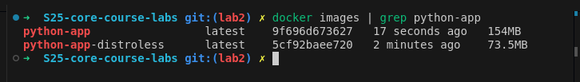

# Docker Best Practices Implementation

Document that outlines the Docker best practices implemented in project Dockerfile

## Security
- Using non-root user `appuser` for security
- Minimal base image (slim)

## Optimization
- .dockerignore to exclude unnecessary files
- Minimal number of layers by combining RUN commands
- Clean-up of apt cache to reduce image size

## File Management
- Proper file ownership with --chown
- Specific COPY instructions for required files
- Workdir set to /src

## Environment
- PYTHONDONTWRITEBYTECODE=1: Prevents Python from writing .pyc files
- PYTHONUNBUFFERED=1: Ensures Python output is sent straight to terminal

# Docker Implementation

## Image Size Comparison

- Standard image: 154MB

- Distroless image: 73.5MB

- Size reduction: ~52%

