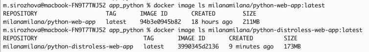

# Best practices

## Elaborate on the best practices you employed within your Dockerfile

### Chose the right base image

The base image python:3.11-slim-bullseye is minimal and officially maintained, which reduces the image size.

### Used non-root user

The Dockerfile follows the principle of running applications as a non-root user, which improves security by minimizing the impact of potential vulnerabilities.

### Layer sanity

The things that changes rarely are upper in the Dockerfile and the things that changes frequently are lower.

### Excluded with .dockerignore

To exclude files not relevant to the build, without restructuring your source repository, used a .dockerignore file.

### Didn't install unnecessary packages

In the Dockerfile there are requirements, that install all necessary packages and nothing else.

## Differences between the Distroless images and previous images

The traditional Python image (211MB) is larger because it includes additional utilities and libraries, such as package managers and shells, which are unnecessary for running the app.

In contrast, the Distroless image (173MB) is smaller as it includes only the runtime essentials, reducing the attack surface and improving security by removing additional components.
