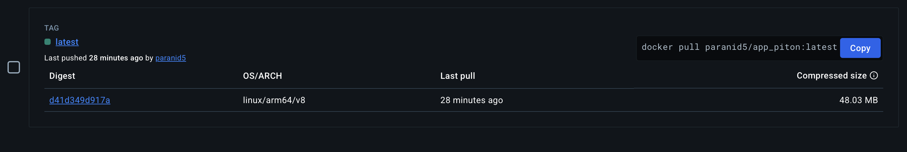
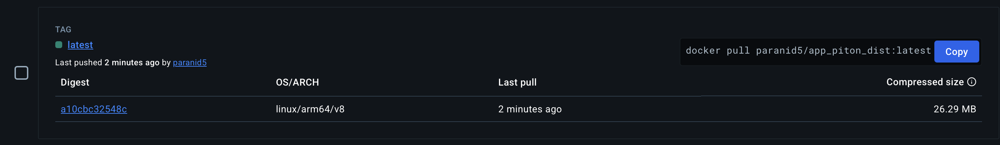

# Docker Image Description

* Base image can be found [here](https://hub.docker.com/repository/docker/paranid5/app_piton/general)

* Distroless image (reduced size) can be found
  [here](https://hub.docker.com/repository/docker/paranid5/app_piton_dist/tags)

## Best practices

### Slim Base Image

Specific version of base image
([python:3.9-slim](https://hub.docker.com/layers/library/python/3.9-slim/images/sha256-b370e60efdfcc5fcb0a080c0905bbcbeb1060db3ce07c3ea0e830b0d4a17f758))
is used a base image in order to protect future deployments from breaking changes.

Additionally, `slim` image for Python is used
to reduces potential risk of attack and minimize overall image size

### Dockerignore & only necessary files

`.dockerignore` is used to remove all files
that are not required to build and deploy application.

Additionally, **COPY** is used in `Dockerfile`
only for necessary files and folders.

### Non-root user

In order to minimize potential attack risks during the image execution,
`Dockerfile` contains command to create user with limited permissions.

### Distroless image

To remove all unnecessary OS files from the base image (python:3.9-slim)
and reduce potential risk from exploiting native OS services,
`distroless.Dockerfile` is provided with the build setup described in `README.md`.

Distroless image helped to significantly reduce the size of final image,
as it can be seen from images below:

* Base image (48 MB)
  

* Distroless image (26 MB)
  
