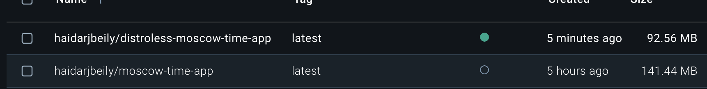

# Docker Implementation Details

## Best Practices Implemented

1. **Base Image Selection**

   - Using official Python slim image for minimal size
   - Specified exact version (3.11.4) with SHA256 hash for reproducibility

2. **Security**

   - Running as non-root user 'appuser'
   - Minimal permissions set
   - No sensitive data in image

3. **Layer Optimization**

   - Copying requirements.txt separately to leverage cache
   - No unnecessary files included (.dockerignore)

4. **Build Efficiency**

   - Single-stage build process
   - No unnecessary dependencies

5. **Image Size Optimization**

   - Slim-based image for smaller footprint
   - No cache in pip install
   - Minimal files copied

6. **Configuration**

   - Environment variables set for Python optimization (PYTHONDONTWRITEBYTECODE, PYTHONUNBUFFERED)
   - Port 8000 exposed
   - Clear CMD instruction using uvicorn

7. **File Management**

   - Using .dockerignore to exclude unnecessary files
   - Proper WORKDIR usage (/app)
   - Minimal file copying (main.py and templates)

8. **Documentation**
   - Well-commented Dockerfile
   - Version information maintained with ARG

## Security Measures

- Non-root user 'appuser' with minimal permissions
- Slim-based minimal image
- No unnecessary packages
- Pinned base image with SHA256 hash for reproducibility

## Distroless Image Comparison

### Image Size Comparison

#### Regular Docker Image

- Base: python:3.11-slim
- Size: ~141MB
- Contains: Python runtime, pip, shell, package manager

#### Distroless Image

- Base: gcr.io/distroless/python3-debian11
- Size: ~92MB
- Contains: Only Python runtime and necessary libraries

## Key Differences

1. **Reduced Attack Surface**
   - No shell access
   - No package manager
   - No unnecessary system tools
   - Minimal system libraries

2. **Security Benefits**
   - Smaller attack surface
   - No ability to install additional packages
   - Reduced vulnerability footprint

3. **Size Optimization**
   - Only includes required runtime components
   - No development tools or debugging utilities
   - Efficient multi-stage build process

4. **Production Ready**
   - Optimized for production deployments
   - Better security posture
   - Faster container startup

