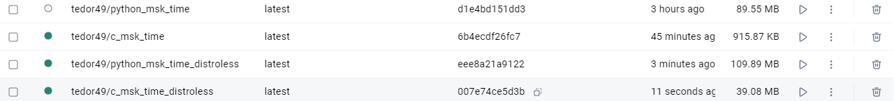

# Docker best practices

I have implemented the following Docker best practices:

- Choosing the right base image:

  I have decided to use python:alpine3.21 since it
  has no vulnerabilities and is very small

- Exclude with .dockerignore

  I have excluded all unnecessary files using .dockerignore,
 this includes .md files, possible standalone builds, and .gitignore

- Create ephemeral containers

  The only thing needed to run the container is forwarding
 a port, and nothing else. As the application is stateless
 itself, the container can be rebooted without the user
 even noticing anything

- Don't install unnecessary packages

  There are no system packages installed at all, only python
 packages that are required to run the server.

- Leverage build cache

  I have sorted the instructions in the following order:
 first, I install python dependencies, since these are
 the least likely, to change, second, I copy the page files and
 the server code, since those are the most likely to change,
 third, I change the user since it is a fast task and needs to be
 done after everything, and I run the server in the end.

- Pin base image versions

  I have pinned the version of alpine that I use.

- Dockerfile instructions

  Only necessary files are copied

  User is changed from root

  Working directory is specified using full path

## Difference between distro and distroless
Surprisingly, the distroless image was larger that the normal
one:

In this case, this is because originally, I was using scratch
image, so there was literally nothing there. Now, there are some
unnecessary tools that bloated the size of the image a bit
