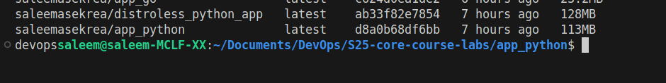

# Docker Best Practices

## Stable Builds with Specific Tags

- Used a specific `sha256` hash along with precise tags to ensure stable and reproducible builds.

## Enhanced Security

- Reduced the attack surface by following security best practices, such as running the application as a non-root user and minimizing the number of installed packages.

## Optimized Image Size

- Utilized the `alpine` version of base images to keep the image size as small as possible.

- Combined multiple `RUN` commands to reduce the number of layers in the image.

## Docker Image

- `python:3.12.8-alpine3.21` as the base image (ightweight image)
- Distroless Docker Image `debian:12-slim`
- final distroless image `gcr.io/distroless/python3-debian12` (minimal image)

## Efficient Dependency Management

- Used the `--no-cache-dir` flag with pip to avoid caching downloaded packages, further reducing image size.

## Metadata and Linting

- Added metadata to the image using `LABEL` for better maintainability and traceability.

- used `hadolint` to ensure the Dockerfile adheres to best practices and is free of common issues.

## Improved Build Performance

- Created a `.dockerignore` file to exclude unnecessary files and directories from the build context, speeding up the build process.

## Minimal Dependencies

- Ensured the `requirements.txt` file contains only the essential packages required for the application.

## Efficient Layer Caching

- Ordered instructions in the Dockerfile so that layers that change the least are placed at the top. This maximizes the use of Docker’s layer caching, reducing build times.

## Use Gunicorn with Uvicorn workers for production

- Better process management, concurrency, and stability in production.

## Multi-Stage Builds for Smaller Images

- For the distroless image, I used multi-stage builds which reduce the image size (depends)

## Distroless Image

- I created a distroless image for the Python app, but its size turned out to be larger than the regular image. This is likely because the regular image is based on Alpine, which is an extremely lightweight distribution. However, despite the size difference, a distroless image provides better security since it has a smaller attack surface, containing only the essential runtime dependencies and no unnecessary system packages.

