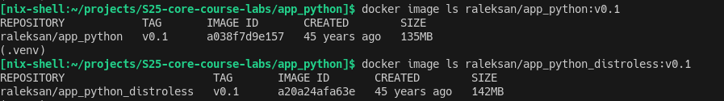

# Docker

## Docker best practices

### 1. Dockerfile linting

[hadolint](https://hadolint.github.io/hadolint/) linter was used to improve the readability, style, and security of the Dockerfile application.

### 2. Using a lightweight base image

I've used Python alpine-based image with minimal size to enhance building speed, decrease final image size as well as number of vulnerabilities.

### 3. Pinned base image version

For this project, I chose the `python:3.12.8-alpine3.21` base image. Using a specific version ensures consistency.

### 4. Copying only specific files

I copied only the necessary files (`app.py`, `requirements.txt`, and the `templates` folder) into the container. This approach minimizes the container's attack surface by eliminating unnecessary files.

### 5. Rootless and UID-independent container

Following Docker security best practices, I created a rootless user named `python_usr` and configured the container to run under that user.

### 6. Dockerignore

I implemented the `.dockerignore` file to exclude files that should not be part of the image build, such as local configuration files or secrets.

### 7. Miscellaneous improvements

- **Prefer COPY instead of ADD**: I used `COPY` to explicitly copy files instead of `ADD` since `COPY` is more predictable and conforms to best security practices.
- **Explicit EXPOSE**: I used the `EXPOSE 8000` directive to explicitly document the intended use of the container on the network.
- **No-Cache Pip Install**: To reduce the image size and improve security, I used the `--no-cache-dir` option in `pip install`.

## Distroless Image Version

I also built a Distroless image for a Python application. The build process is described in `README.md`.

The resulting Distroless image is almost 10 MB heavier than the original image. I suppose this is because I used a slim Python image to load the dependencies.

It was difficult to create a container based on the Python alpine image (which was used in the original) that would easily run my web application.

I think this approch is more effective for languages with compiled binaries.
