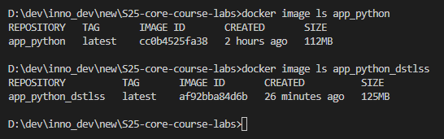

# Docker

## Best practices employed

- No root user inside, so the container will run safely.
- Using `COPY` to copy only specific files (`requirements.txt`, application files, and `time.html` template file) from the application folder so that confidential files if such exist are not exposed.
- Layer sanity - the commands are grouped as tight as possible to prevent appearance of extra layers. Moreover, the commands that are less likely to change and easier to cache are placed first.
- Using a `.dockerignore` file.
- Using a precise version of the base image and language (`python:3-alpine3.21`)
- Installing only necessary packages (excluding packages for linting and formatting which are not required at the runtime).
- Packages installed via `apk add` have specific version specified.
- Dockerfile was linted using [hadolint](https://hadolint.github.io/hadolint/)
- Only one necessary port is exposed (`80`).
- Trusted base image was used in this Dockerfile ([python](https://hub.docker.com/_/python) - Docker Official Image)
- `HEALTHCHECK` instruction was included to ensure that the web application is healthy.

## Distroless Image

The distroless image of this Python application appeared to be 13 MB larger than the original one. Unfortunately, using `alpine` image during build stage was not successful and lead to an error during runtime stage.
The larger size of a distroless image was most probably caused by the slim base image used in the build stage of the distroless image.

Moreover, since the application do not require an explicit build stage, such approach is not efficient as it could be.
