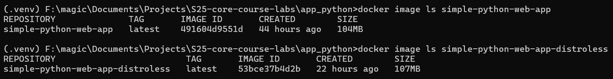

# Python Web Application

## ✅ Best Practices

### Using linter

I use `hadolint` linter to ensure that `Dockerfile` adheres to best practices and to identify possible problems early.

### Minimal base image

I use a lightweight image that is based on Alpine Linux and I specify the exact versions of Python and Alpine. This reduces the image size and the potential attack surface.

### Using working directory

I set the `WORKDIR`, which improves code readability and prevents some bugs with incorrect paths from appearing.

### Installing only required dependencies

By using `requirements.txt` file with `--no-cache-dir` flag I install only those packages that are required and do not save unnecessary caches.

### Copying only necessary files

By using `.dockerignore` and copying only specific files, I reduce the image size and the potential attack surface.

### Using nonroot user

I create and use a nonroot user to run the application, reducing security risks.

### Layer sanity

File copying and requirements installation steps are ordered to utilize Docker layer caching.

## 🐟 Distroless Version

### Size comparison

A distroless image turned out slightly larger than a distro-based image (107 MB vs 104 MB, respectively).

This is probably due to me using Alpine Linux based image for distro-based version and Debian based image for distroless version. Although distroless is a stripped down version of Debian, it is still slightly larger than Alpine.

### Differences from distro-based version

- Smaller attack surface

    By removing shells, package managers, and other tools, we lower the amount of components in the container, therefore, reducing the attack surface.

- Image size

    Usually, the distroless version has a smaller image size, due to different components being removed. But in this case, ordinary Alpine version was a little smaller.

- Worse debugging

    Due to different components being removed, the debugging capabilities are more worse than in distro-based version.

### Final result

