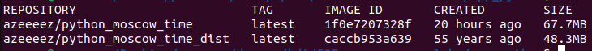

# Moscow Time Web App

## Applied practices

- **Choosing the right base image**: using precise and official base images.
- **Excluding with .dockerignore**: use `.dockerignore` to exlude irrelevant files.
- **No root iamge**: build image with as no-root user for higher security.

## Comparison

The Distroless image for the Python application is significantly smaller than the ususal image. This is because Distroless images tehd to be minimal and only include the essential components needed to run the application,
