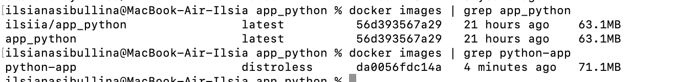

# Docker Best Practices

## Best Practices Employed

1. **Non-Root User**:
   - The Dockerfile creates a non-root user (`nonrootuser`) to avoid running containers as root, improving security.

2. **Efficient Layer Caching**:
   - Copied `requirements.txt` first to leverage Docker's caching mechanism, avoiding reinstallation of dependencies when source code changes.

3. **Clean Installations**:
   - Used `--no-cache-dir` with `pip install` to avoid unnecessary temporary files in the image.

4. **File Ownership**:
   - Used `--chown` to assign ownership of files to the non-root user.

5. **.dockerignore Usage**:
   - Added a `.dockerignore` file to exclude unnecessary files and reduce the build context.

6. **Ephemeral Container**:
   - Designed the container to be stateless and modular, enabling easy replacement and scaling.

7. **Multi-Stage Builds**:
   - Named build stage to enhances clarity and maintainability. It ensures instructions remain functional even if the Dockerfile's stages are re-ordered.

## Distroless Image

The Distroless image minimizes the attack surface and reduces overall image size by excluding unnecessary OS components. However, in my case, I used Python Slim for the Distroless image, resulting in a size of 87.9MB—about 25MB larger than the previous image, which was based on Python Alpine and has size 63.1MB.

To experiment, I modified the previous Dockerfile by switching from Alpine to Slim, which increased the image size to 161MB. This demonstrates that the Distroless image is still smaller, as it includes only the minimal runtime environment needed to run the application. This enhances security, performance, and deployment efficiency.

