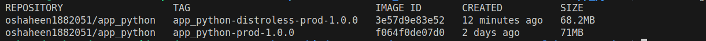

# Docker Best Practices

This document outlines the Docker best practices implemented in the `app_python` project. It explains the rationale behind each practice and how it is applied in the Dockerfile.

---

## 1. Multi-Stage Builds

- The Dockerfile uses a **multi-stage build** to separate the build environment from the runtime environment. This reduces the final image size and improves security.

## 2. Non-Root User

- A **non-root user (`app`)** is created and used to run the application, enhancing security by avoiding root privileges.

## 3. Layer Sanity

- Only necessary files (`app.py` and `templates/`) are copied into the image, minimizing layers and keeping the image size small.

## 4. Environment Variables

- Environment variables like `PYTHONDONTWRITEBYTECODE=1` and `PYTHONUNBUFFERED=1` are set to optimize Python's behavior in a containerized environment.

## 5. Precise Base Image

- A specific version of the base image (`python:3.13.1-alpine3.21`) with a **SHA256 hash** is used for reproducibility and security.

## 6. Virtual Environment

- A **virtual environment (`/opt/venv`)** is created to isolate Python dependencies, ensuring clean dependency management.

## 7. Caching Dependencies

- The `--mount=type=cache,target=/root/.cache/pip` flag is used to cache pip dependencies, speeding up subsequent builds.

## 8. Linting

- Linting tools (`flake8` and `pylint`) are used to ensure code quality and maintain consistency.

## 9. `.dockerignore` File

- A `.dockerignore` file excludes unnecessary files and directories, reducing the build context size and improving build performance.

## 10. Explicit Port Exposure

- Port `5000` is explicitly exposed to document the application's network requirements.

## 11. Prefer COPY Over ADD

- The `COPY` instruction is used instead of `ADD` to copy files into the image. `COPY` is preferred because it is more transparent and predictable, whereas `ADD` has additional features (like URL support and automatic extraction of tar files) that are not always necessary and can lead to unexpected behavior.

## 12. Prefer ENTRYPOINT and CMD

- The `ENTRYPOINT` instruction is used to define the main command for the container, while `CMD` can provide default arguments. This combination allows the container to behave like an executable, making it easier to override arguments when needed. In this project, `ENTRYPOINT` is used to run the Flask application, ensuring consistent behavior.

## 13. Pin Base Image Versions

- The base image version is explicitly pinned (`python:3.13.1-alpine3.21`) and includes a **SHA256 hash** for additional security and reproducibility. This ensures that the same base image is used every time the Dockerfile is built, avoiding unexpected changes or vulnerabilities that might come with using the `latest` tag.

---

## 14. Distroless Image Comparison

We also experimented with **Distroless images**, which are minimal images containing only the application and its runtime dependencies, with no package manager or shell. The main differences between the Distroless images and the previous Docker images are as follows:

### **Key Differences:**

- **Smaller Image Size:**  
  - Distroless images are smaller because they only include the essential components needed to run the application.  
  - Example sizes:
    - `app_python-distroless-prod-1.0.0`: **68.2MB**
    - `app_python-prod-1.0.0`: **71MB**
  
- **Reduced Attack Surface:**  
  - By removing unnecessary packages like shell utilities and package managers, Distroless images have a **smaller attack surface**, making them more **secure**.

- **Performance Benefits:**  
  - Smaller image sizes translate to **faster builds** and **quicker deployments**, which can be a major advantage in environments with rapid scaling or frequent updates.

---

### **Image Size Comparison:**

   
