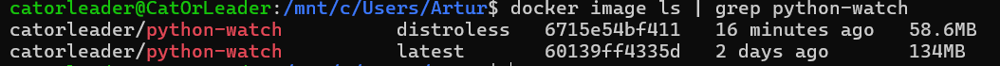

# Overview

Let's begin with a step-by-step explanation of all the solutions I used to create a Dockerfile:

---

## Base Image Selection

- **Precise Image**: Use a specific image version to preserve the stability of the build and ensure that no changes can
  be made by third parties (image owners).
- **Slim Version**: Choose the slim version to reduce the size of the resulting image.

  ```dockerfile
  FROM python:3.12.0-slim AS base
  ```

## Security Enhancements

- **Non-Root User**: Create a non-root user to enhance security by preventing the use of the root user.

  ```dockerfile
  RUN useradd -m appuser
  USER appuser
  ```

## Directory Structure

- **Working Directory**: Setting up the working directory is a standard in image creation because it helps to maintain a
  clear file structure.

  ```dockerfile
  WORKDIR /app
  ```

## File Management

- **Selective File Copying**: Copy only the necessary files for the application to start and run properly.
- **Order of COPY Commands**: Arrange the `COPY` commands in descending order of volatility, from the most volatile
  files to the most stable, to catch build errors earlier.
- **Ownership**: Ensure the correct `appuser` ownership is applied to the application sources.

  ```dockerfile
  COPY --chown=appuser:appuser requirements.txt .
  COPY --chown=appuser:appuser app/.env* ./
  COPY --chown=appuser:appuser app ./app
  COPY --chown=appuser:appuser run.py .
  ```

## Dependency Management

- **Install Dependencies**: Run dependencies installation with no cache to avoid using external space.

  ```dockerfile
  RUN pip install --no-cache-dir -r requirements.txt
  ```

## Container Startup

- **ENTRYPOINT Command**: Use the `ENTRYPOINT` command because we have a single application and generally do not want
  users to override container startup logic.

  ```dockerfile
  ENTRYPOINT ["python", "run.py", ".env"]
  ```

## Optimization

- **.dockerignore Usage**: Additionally, include a `.dockerignore` file to exclude unnecessary files from the final
  image.
- **Lint**: I used the <https://hadolint.github.io/hadolint/>

---

Additionally, I do not use multi-stage builds because for Python applications that are not compiled
this is unnecessary.

---

## Distro VS. Distroless Images

| Type       | Size   |
|------------|--------|
| Distroless | 58.6MB |
| Distro     | 134MB  |



## Main Differences

- Distroless images have a smaller image size (obviously), because inside the container there is no unnecessary stuff like shells,
  additional OS components, etc. In our case, we have size 2x smaller.
- No shell—no additional way to exploit into the image. Absence of such OS components literally reduces the possible attacker's space of entry.
- Not chaotically good—this is hard to debug anything using the distroless image because there are no tools for it.
- Ideal for production development, no need to upgrade the external components (OS, tools) that do not affect the application directly.

---
