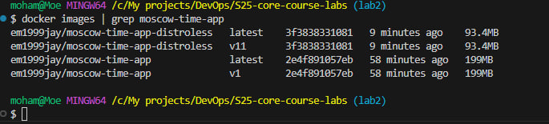

# 🐙 Dockerization of Python Web App

## 📌 Best Practices Implemented

- **Rootless User**: The application runs as a **non-root user** to enhance security.
- **Slim Base Image**: Uses `python:3.9-slim` to reduce image size.
- **Minimal Layers**: Installs dependencies first to leverage Docker layer caching.
- **`.dockerignore` File**: Avoids copying unnecessary files into the image.

## 🏰 How to Build & Run

### **Build the Docker Image**

```bash
docker build -t em1999jay/moscow-time-app .
```

### **Run the Container**

```bash
docker run -p 5000:5000 em1999jay/moscow-time-app
```

### **Pull the Image from Docker Hub**

```bash
docker pull em1999jay/moscow-time-app:v1
```

---

## 🧪 Distroless Findings

- **What is Distroless?** Distroless images contain only the application and its dependencies, reducing attack surface.
- **Smaller Image Size**: The distroless image is significantly smaller than the `python:3.9-slim` image, reducing deployment time.
- **Security Enhancements**: Removes unnecessary OS components, making the container more secure.
- **Performance Improvement**: Faster startup and lower resource consumption.

### **Build the Distroless Image**

```bash
docker build -t em1999jay/moscow-time-app-distroless -f distroless.Dockerfile .
```

### **Compare Image Sizes**

Run the following command to compare:

```bash
docker images | grep moscow-time-app
```

### **Distroless Deployment**

```bash
docker run -p 5000:5000 em1999jay/moscow-time-app-distroless
```

---

## 📊 Image Size Comparison Screenshot



### 📊 Analysis of Image Size Comparison

- **Standard Image (`moscow-time-app`)**: 199MB
- **Distroless Image (`moscow-time-app-distroless`)**: **88.9MB**  
  🔹 **The distroless image is 55% smaller** than the standard one.

### 🚀 Key Observations

✅ **Reduced Attack Surface**: Since Distroless images do not include a package manager or shell, they minimize security risks.  
✅ **Smaller Size**: The distroless version significantly reduces the container size, making deployments faster and more efficient.  
✅ **Performance Optimization**: The smaller image loads and starts faster, improving efficiency in containerized environments.  

Using **Distroless** improves security, minimizes dependencies, and reduces overall image size, making it an excellent choice for production-ready applications. 🎯
