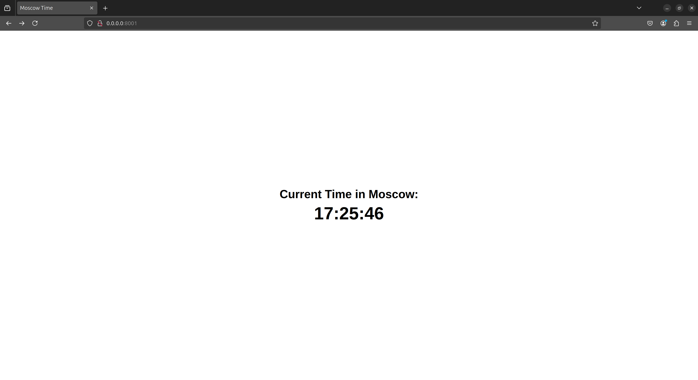

# Moscow Time Web-Application

## Technological Stack

For this application I have used [FastAPI](https://fastapi.tiangolo.com/).
It is modern, high-performance, easy to use Python framework.
It is appropriate for this application because it is easy and fast to develop with it.

## Best Practices

- Automatic interactive OpenAPI documentation.
- Pydantic models for response validation and serialization.
- Code documentation and comments.
- Proper code naming.
- Clean code structure.
- PEP8 coding style.

## Coding Standards and Code Quality

- I used [Black](https://black.readthedocs.io) to format the code.
- I used [isort](https://pycqa.github.io/isort/) to sort the imports.
- I used [Flake8](https://flake8.pycqa.org) to check the code style and quality.

## Testing

- I tested the application by running it and checking the displayed time in Moscow using the browser.
- Then I tested the application by refreshing the page and checking if the displayed time updates.

