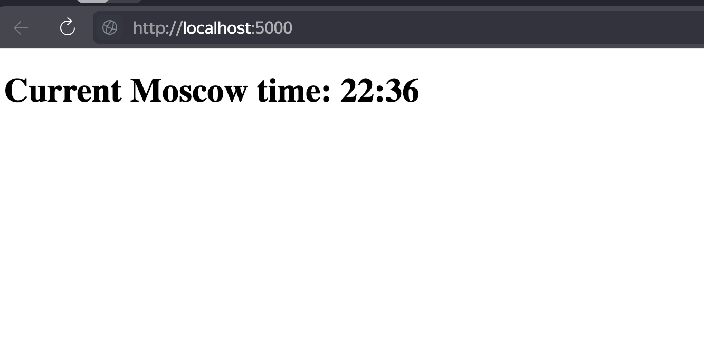
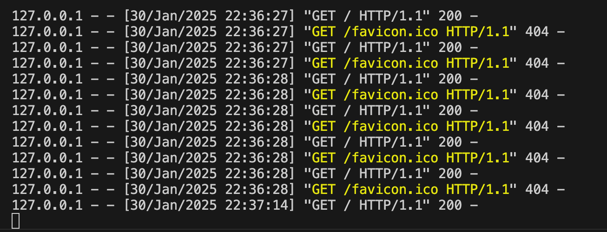

## Framework selection

I use flask framework. Reasons why:

* I am familiar with this framework for creating web apps.
* It is simple for this kind of web applications
* I don't have to make difficult structure for it, I wrote only 2 files to make app work (might even did all in one file)

## Code standards

* I created a file structure 
```
app_python/
│
├── app/
│   ├── __init__.py
│   ├── routes.py
│   └── templates/
│       └── index.html
│
├── tests/
│   └── test_time.py
│
├── run.py
├── Dockerfile
├── DOCKER.md
├── README.mc
├── PYTHON.md
├── requirements.txt
└── .dockerignore
```
* I created a virtual env for python (it is ignored by git)
* I created .gitignore file to keep code clean
* requirements.txt are on place, it is easy for user to download all needed dependencies
* For all others code standards code is too small yet to show it
* Tests are in pictures below, and in unit tests in ./tests folder



