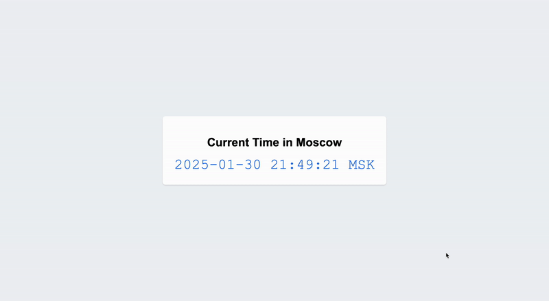

# Real-Time Moscow Clock 🕒


<!--  -->



### A simple real-time web application, which allows you to see Moscow time. App uses Flask framework and best practices in web development.

## ✨ Features
- **Real-time Updates**: Live clock updates every second
- **Accurate Timezone Handling**: Precise Moscow time using pytz
- **Responsive Design**: Interface which works on all devices

## 🚀 Quick Start

### Prerequisites

- Python 3.8 or higher
- pip (Python package manager)
- Git (for version control)

### Installation

1. **Clone the Repository**
   ```bash
   git clone https://github.com/TimurZheksimbaev/S25-core-course-labs/tree/lab1
   cd app_python
   ```

2. **Create Virtual Environment**
   ```bash
   python -m venv venv
   
   # Windows
   .\venv\Scripts\activate
   
   # Unix/MacOS
   source venv/bin/activate
   ```

3. **Install Dependencies**
   ```bash
   pip install -r requirements.txt
   or 
   pip3 install -r requirements.txt
   ```

4. **Run the Application** (choose on which port to run )
   ```bash
   flask run -g 0.0.0.0 -p 3000
   ```

5. **Open your browser and navigate to `http://localhost:3000`**

## 🧪 Testing

Code is covered in tests, including time accuracy and comparing current system time with time coming from web app

Run the test suite:
```bash
pytest
```

View test coverage:
```bash
pytest --cov=app tests/
```


## 🐳 Docker 

### Building the Image

1. Clone the repository:
```bash
git clone https://github.com/TimurZheksimbaev/S25-core-course-labs.git
cd app_python
```

2. Build the Docker image:
```bash
docker build -t timurzheksimbaev/time_web_application:latest .
```

### Pulling the Image

Pull the image from Docker Hub:
```bash
docker pull timurzheksimbaev/time_web_application
```

### Running the Container

1. Run the container:
```bash
docker run -d -p 3000:3000 --name time_web_application timurzheksimbaev/time_web_application
```

2. Access the application:
- Open your browser and go to `http://localhost:3000`

3. Stop the Container
```bash
docker stop time_web_application
```
