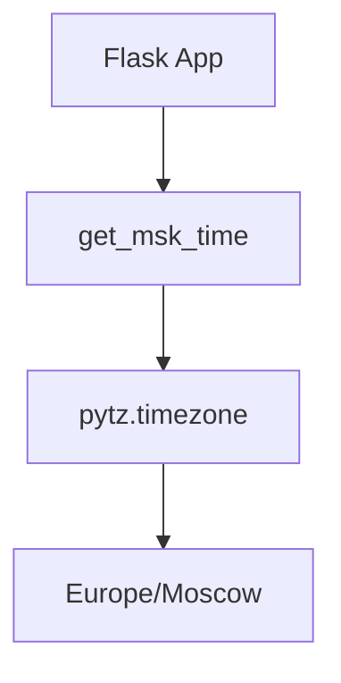

# Python Implementation Details

## Architecture


## Best Practices

### 1. Framework Choice
**Flask** was selected for:
- Minimal boilerplate
- Built-in WSGI server
- Extensibility via Blueprints

### 2. Virtual Environment
```bash
# Create isolated environment
python -m venv venv

# Freeze dependencies
pip freeze > requirements.txt
```

### 3. Code Quality
- **PEP8 Compliance**: Enforced via `flake8`

```yaml
# CI workflow step
- name: Lint
  run: flake8 . --count --statistics
```

- **Type hints** for critical functions:

```python
def get_msk_time() -> datetime:
    return datetime.now(pytz.timezone('Europe/Moscow'))
```

### 4. Testing Strategy
**Tools:**
- `pytest`: Test runner
- `freezegun`: Time mocking

**Test Cases:**

```python
# Validate timezone offset
@freeze_time("2024-01-01 12:00:00")  # UTC
def test_winter_time():
    assert get_msk_time().hour == 15  # UTC+3

# Check formatting
def test_time_format():
    assert len(get_msk_time().strftime('%H:%M:%S')) == 8
```

### 5. Timezone Management
- **Server Agnostic**: Avoids system time dependency
- **DST Handling**: Automatic adjustment via `pytz`
- **ISO 8601**: Standardized output formatting
