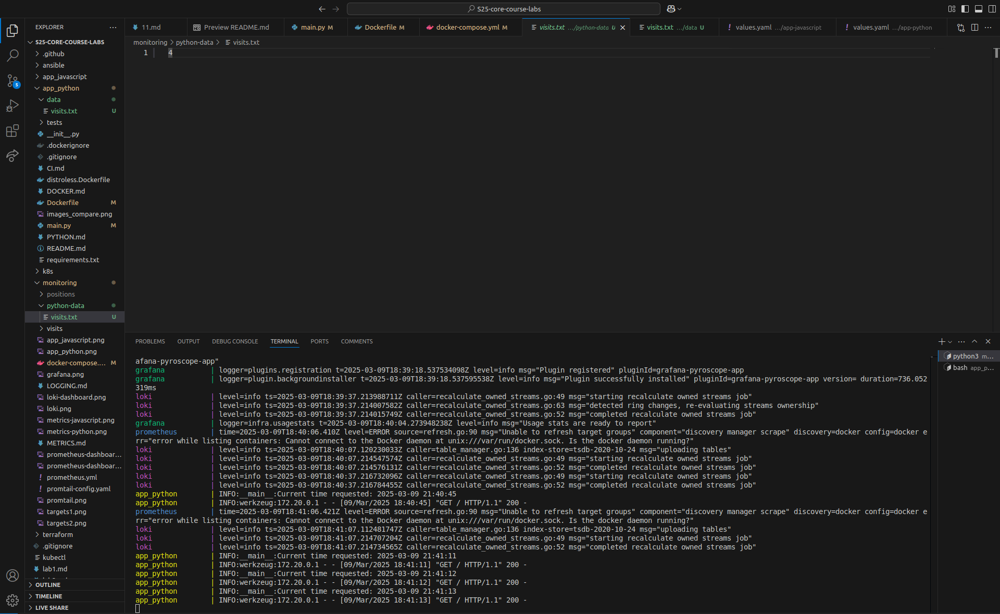

# Python Web Application - Current Time in Moscow

[](https://github.com/Kazan-Strelnikova/S25-core-course-labs/actions)

This is a simple web application built using **Python** and the **Flask** framework to display the current time in **Moscow**, Russia.

## Overview

This web app shows the current time in Moscow, updating each time the page is refreshed. It uses the **Flask** framework for creating the web server and the **pytz** library for handling timezones.

## Features

- Displays the current time in Moscow.
- Automatically updates the time on page refresh.
- Built with **Flask** for simplicity and efficiency.

## Setup and Installation

### Prerequisites

- Python 3.x
- pip (Python package installer)

### Steps to Run the App

1. **Clone the repository**:

    ```bash
        git clone https://github.com/Kazan-Strelnikova/S25-core-course-labs.git
        cd S25-core-course-labs/app_python
    ```

2. **Install dependencies**:

    ```bash
        pip install -r requirements.txt
    ```

3. **Run the application**:

    ```bash
    python app.py
    ```

4. **Open the app in your browser: Go to <http://localhost:5000> to see the current time in Moscow.**

## Docker Usage

This project can be easily run in a Docker container. Follow the instructions below to build, pull, and run the Dockerized application.

### How to Build

1. Make sure Docker is installed and running on your machine.

2. In the root folder of the project, build the Docker image with the following command:

   ```bash
   docker build -t kira354/app-python .
   ```

### How to Pull

If you want to use the pre-built image from Docker Hub, run the following command:

```bash
docker pull kira354/app-python:latest
```

### How to Run

After building or pulling the image, run the following command to start the application:

```bash
docker run -p 5000:5000 kira354/app-python
```

This will run the application inside the Docker container and map port 5000 of the container to port 5000 on your local machine. You can now access the application by visiting [http://localhost:5000](http://localhost:5000) in your browser.

## **Distroless Image Version**

### **How to Build the Distroless Image**

1. Build the Docker image for the Distroless version:

   ```bash
   docker build -f distroless.Dockerfile -t kira354/app-python-distroless .
   ```

### **How to Pull the Distroless Image**

To pull the Distroless version of the app from Docker Hub:

```bash
docker pull kira354/app-python-distroless
```

### **How to Run the Distroless Image**

To run the Distroless image:

```bash
docker run -p 5000:5000 kira354/app-python-distroless
```

## Unit Tests

The Python application includes comprehensive unit tests to validate its functionality. The tests are written using Python's built-in `unittest` framework and are located in the `app_python/tests/` directory.

### What is Tested?

- **Current Time Endpoint:**  
  The primary function tested is `current_time` which returns the current time in the Moscow timezone in a specific format. The unit test ensures that:
  - The function retrieves the correct time for Moscow.
  - The time is formatted as `YYYY-MM-DD HH:MM:SS`.
  - The output string matches the expected format.

### How to Run the Tests

To run the unit tests locally, navigate to the repository's root directory and execute:

```bash
pytest app_python/tests/
```

## Continuous Integration (CI) Workflow

This project uses GitHub Actions to automatically build, test, lint, and deploy the Python application. The CI workflow is defined in the [python-ci.yml](.github/workflows/python-ci.yml) file and is triggered on every push or pull request that includes changes in the `.github/workflows/**` or `app_python/**` directories.

### CI Workflow Breakdown

The CI pipeline consists of the following essential steps:

1. **Dependencies Installation:**  
   - The workflow sets up the Python environment using Python 3.10.
   - It then installs the required dependencies from the `app_python/requirements.txt` file.
   - This ensures that the environment is ready for testing and linting.

   ```yaml
   - name: Set up Python
     uses: actions/setup-python@v2
     with:
       python-version: '3.10'

   - name: Install dependencies
     run: |
       python -m pip install --upgrade pip
       pip install -r app_python/requirements.txt
   ```

2. **Running Tests:**  
   - The tests are executed using `pytest` on all tests located in the `app_python/tests/` directory.
   - This step ensures that all unit tests pass and that code functionality is validated before deployment.

   ```yaml
   - name: Run tests
     run: |
       pytest app_python/tests/
   ```

3. **Linting:**  
   - The workflow runs [flake8](https://flake8.pycqa.org/en/latest/) on the `app_python` directory to check the code for style and syntax errors.
   - This enforces code quality standards and helps catch potential issues early.

   ```yaml
   - name: Lint code
     run: |
       pip install flake8
       flake8 app_python
   ```

4. **Docker Integration:**  
   The workflow integrates Docker steps to automate the containerization process:

   - **Docker Hub Login:**  
     Uses the official Docker login action to authenticate with Docker Hub using the repository secrets (`DOCKER_HUB_NAME` and `DOCKER_HUB_PASSWORD`).

     ```yaml
     - name: Log in to Docker Hub
       uses: docker/login-action@v2
       with:
         username: ${{ secrets.DOCKER_HUB_NAME }}
         password: ${{ secrets.DOCKER_HUB_PASSWORD }}
     ```

   - **Build Docker Image:**  
     The Docker image is built using the `app_python/distroless.Dockerfile`.  
     The image is tagged as `latest` and namespaced with Docker Hub username.

     ```yaml
     - name: Build Docker image
       run: |
         docker build -f app_python/distroless.Dockerfile -t ${{ secrets.DOCKER_HUB_NAME }}/app_python-distroless:latest ./app_python
     ```

   - **Push Docker Image:**  
     After a successful build, the Docker image is pushed to Docker Hub, making it available for deployment.

     ```yaml
     - name: Push Docker image to Docker Hub
       run: |
         docker push ${{ secrets.DOCKER_HUB_NAME }}/app_python-distroless:latest
     ```

### Summary

This CI pipeline automates key processes, ensuring that:

- All dependencies are correctly installed.
- The code adheres to style guidelines via linting.
- Automated tests validate code functionality.
- The Docker image is built and deployed to Docker Hub for consistent and reliable delivery.

Every commit and pull request that affects the relevant parts of the repository(app_python folder) triggers this workflow, ensuring continuous integration and delivery best practices are maintained.

## Upgrade Application for Persistence

This update enhances the application by implementing a persistent counter that tracks the number of times it has been accessed. The counter is stored in a visits.txt file, ensuring data persists even after container restarts. A new /visits endpoint displays the recorded visit count. The docker-compose.yml file has been updated to mount a volume for persistent storage. To use the feature, run the application with docker-compose up --build and access http://localhost:5000/visits to see the visit count.

