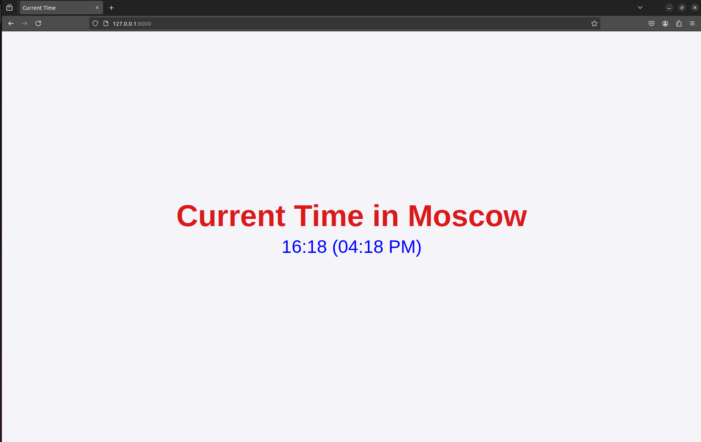

# Moscow Time Web-Application

[](https://github.com/saleemasekrea000/S25-core-course-labs/actions/workflows/python_app.yaml)

This is a simple web application that displays the current time in Moscow. The application is developed using Python and FastAPI framework.

## Table of Contents

- [Table of Contents](#table-of-contents)
  - [Installation](#installation)
    - [Requirements](#requirements)
    - [Manual](#manual)
    - [Docker](#docker)
    - [Distroless Image Version](#distroless-image-version)
  - [Development](#development)
    - [Unit Tests](#unit-tests)
    - [CI Workflow](#ci-workflow)

## Installation

### Requirements

- Python 3.8 or higher
- `pip` package manager

### Manual

- Clone this branch to your local machine

```bash
git clone git@github.com:saleemasekrea000/S25-core-course-labs.git -b lab1
```

- Navigate to the `app_python` folder

```bash
cd app_python
```

- Create and activate a virtual environment

```bash
python3 -m venv venv
source venv/bin/activate
```

- Install the required packages

```bash
pip install -r requirements.txt
```

- Run the application

```bash
cd ..
```

```bash
uvicorn app_python.app:app
```

The application will be available at [localhost:8000](http://localhost:8000/)



## Docker

- To build the image, use the following command:

```bash
docker build -t saleemasekrea/app_python .
```

- To pull the image from the Docker Hub, use the following command:

```bash
docker pull saleemasekrea/app_python:latest
```

- After building or pulling the image, the container can be run with the following command:

```bash
docker run -p 8000:8000 saleemasekrea/app_python
```

The application will be available at [localhost:8000](http://localhost:8000/)

## Distroless Image Version

- To build the image, use the following command:

```bash
docker build -f distroless.Dockerfile -t saleemasekrea/distroless_python_app .
```

- To pull the image from the Docker Hub, use the following command:

```bash
docker pull saleemasekrea/distroless_python_app:latest
```

- After building or pulling the image, the container can be run with the following command:

```bash
docker run -p 8001:8001 saleemasekrea/distroless_python_app 
```

The application will be available at [localhost:8001](http://localhost:8001/)

## Development

Contributions are not accepted at the moment as this is just a lab assignment. You can fork the repository for your own use.

### Unit Tests

Unit tests are maintained in the `test.py` file. To run the tests, use the following command:

```bash
python -m unittest app_python/test.py # Make sure that you are in the parent directory of app_python
```

To check the code coverage, use the following command:

```bash
coverage run -m unittest app_python/test.py
coverage report
```

### CI Workflow

A CI workflow is maintained in the `.github/workflows/python_app.yaml` file. This workflow lints and tests the application,checks code vulnerability using SNYK ,and builds and pushes docker image. Workflow is triggered only if the there is a change in the app_python directory or the workflow file itself.

The CI workflow contains 3 jobs. Each job has a specific set of tasks to perform:

- Build: This job lints and tests the application
- Security: This job checks code vulnerability using SNYK
- Docker: This job builds and pushes the docker image to the Docker Hub. The job is carried out only if the previous jobs are successful.
