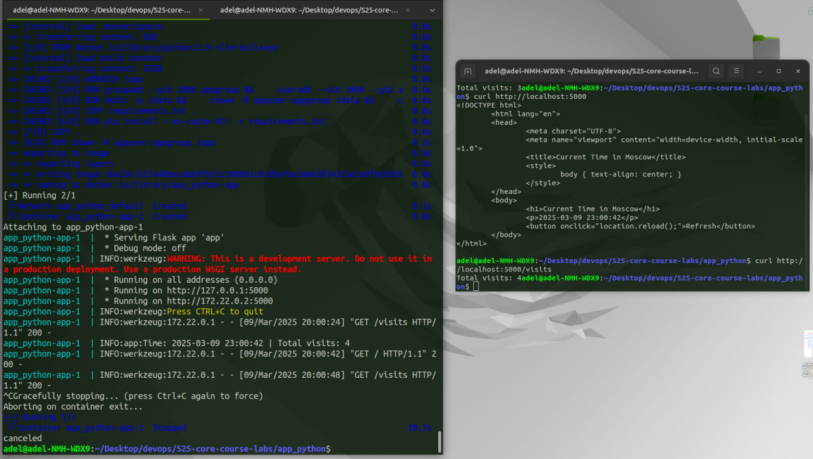
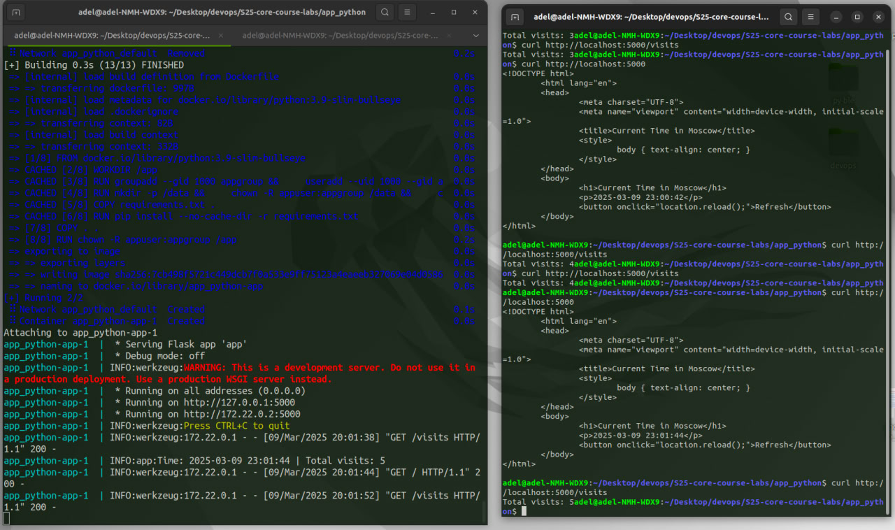

# Python Moscow Time Web App

## Overview

This application displays the current time in Moscow.
Refresh the page to see the displayed time update.

## Requirements

- Python 3.8+
- See requirements.txt for Python dependencies

## Installation

- Clone repo:

```git clone https://github.com/G3nD4/S25-core-course-labs.git```

- Go to root app folder:

```cd app_python```

- Install requirements:

```pip install -r requirements.txt```

## Usage

- Run app:

```python app.py```

- Run tests:

```pytest```

## Build Docker Image

- You can build and run Docker Image locally using following commands:

```docker build -t python-web:latest .```

```docker run -d --name python-web -p 5000:5000 python-web:latest```

- Or you can pull my image and run it:

```docker pull g3nd4/python-web:latest```

```docker run -d --name python-web -p 5000:5000 g3nd4/python-web:latest```

## CI

- Triggered on push events affecting the app_python folder or its CI file.
- Defines several jobs that run sequentially:
  
  - Build  
    - Checks out the repository  
    - Sets up Python  
    - Installs dependencies in the app_python folder

  - Linter  
    - Runs after build  
    - Installs and executes flake8 to check code style

  - Test  
    - Runs after build and linter  
    - Installs dependencies and runs unit tests using pytest

  - SNYK  
    - Runs after linter and test  
    - Scans the app for vulnerabilities using SNYK

  - Docker  
    - Runs after build, linter, test, and SNYK  
    - Logs into Docker, builds the image, and pushes it to the registry

## Visits Counter

The number of application accesses is persistently stored in `visits` file.
You can access the visits counter using `GET /visits` endpoint.

Proof of persistent visits storage with Docker Volumes:





