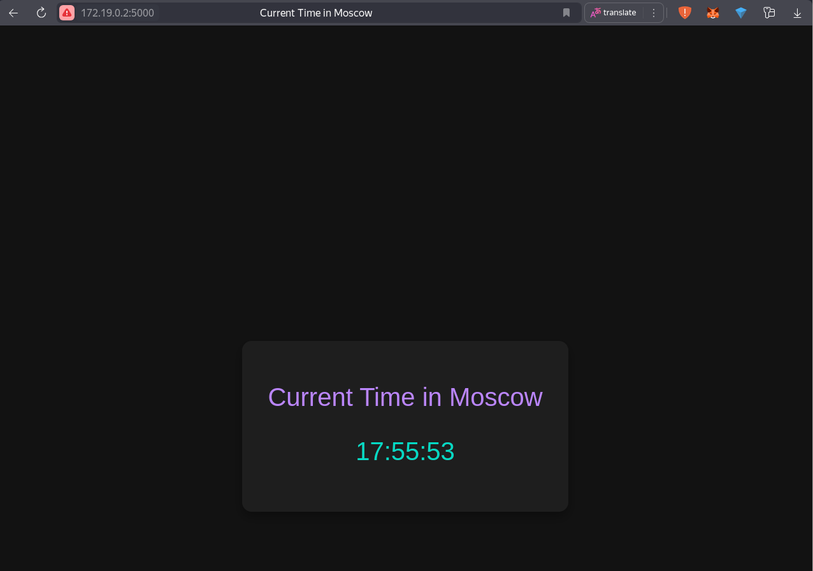
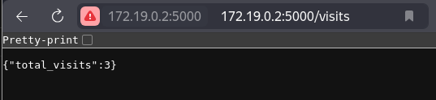

# Python Web Application

This is a simple Python web application built using the Flask framework. It displays the current time in Moscow and updates it locally on the client side without making repeated server requests.

## Features
- Displays Moscow Time accurately.
- Local time updates every second using JavaScript.
- Tracks and displays visit counts.
- Lightweight and efficient, with minimal server-side logic.

## Installation

1. Clone the repository:
   ```bash
   git clone <repository_url>
   cd app_python
   ```

2. Set up a virtual environment:
   ```bash
   python3 -m venv venv
   source venv/bin/activate  # On Windows: venv\Scripts\activate
   ```

3. Install the required dependencies:
   ```bash
   pip install -r requirements.txt
   ```

## Running the Application

1. Start the Flask development server:
   ```bash
   python app.py
   ```

2. Open your browser and visit:
   ```
   http://127.0.0.1:5000/     # Main page with Moscow time
   http://127.0.0.1:5000/visits  # View total visit count
   ```

## API Endpoints

- `/` - Main page displaying Moscow time
- `/visits` - Returns JSON with total visit count
- `/metrics` - Prometheus metrics endpoint

## File Structure
- **app.py**: Main application file containing the Flask routes.
- **templates/**: Contains the HTML templates for the application.
- **static/**: Includes static assets like CSS and JavaScript files.
- **/data/visits.txt**: Stores the visit counter (when running in Docker)

## How It Works
- The server fetches Moscow Time using Python's `datetime` and `pytz` libraries.
- The initial time is rendered into the HTML template.
- JavaScript updates the time locally every second to ensure smooth performance.
- Visit counts are persisted to a file and survive container restarts.

## Testing
- Verified that the time is correct on page load.
- Ensured the time updates locally without additional server requests.
- Tested with altered local system time to validate Moscow Time accuracy.

## Unit Tests
The application includes comprehensive unit tests to ensure reliability and maintainability:

### Test Coverage
- Route testing for all endpoints
- Time formatting validation
- Timezone conversion accuracy

### Running Tests
```bash
# Run all tests
python -m unittest discover tests

# Run with coverage report
coverage run -m unittest discover tests
coverage report
```

### Test Documentation
Detailed testing documentation is available in PYTHON.md, including:
- Testing strategy and best practices
- Test case descriptions
- Coverage reports and goals

## Best Practices
- Follows PEP 8 coding standards for readability.
- Implements clean separation of concerns with templates and backend logic.
- Optimized for performance by reducing redundant server requests.

## Continuous Integration

This project uses GitHub Actions for CI/CD pipeline. The workflow includes:

### CI Pipeline Steps
1. **Dependencies Installation**
   - Sets up Python environment
   - Installs required packages
   - Configures development dependencies

2. **Code Quality**
   - Runs Flake8 linter
   - Checks code style and complexity
   - Enforces PEP 8 standards

3. **Testing**
   - Executes unit tests
   - Validates functionality
   - Ensures code reliability

### CD Pipeline Steps
1. **Docker Build**
   - Builds Docker image
   - Tags with version
   - Prepares for deployment

2. **Docker Push**
   - Authenticates with Docker Hub
   - Pushes image to registry
   - Makes deployment available

# Docker

## Using Docker Compose (Recommended)
The easiest way to run the application is using Docker Compose:

1. Start the application:
```bash
docker-compose up
```

2. For rebuilding after changes:
```bash
docker-compose up --build
```

3. To stop the application:
```bash
docker-compose down
```

## Manual Docker Commands
Alternatively, you can use Docker directly:

### How to build?
```sh
   docker build -t your-user-name/app-name .
```
## How to pull?
In case you just want to download ready docker image from docker-hub
```sh
   docker pull forygg/moscow-never-sleeps:v1.0 
   ## my image used for example
```
## How to run?
After you pulled the image or built it you can run it
```sh
   docker run -p 5000:5000 -v $(pwd)/data:/data forygg/moscow-never-sleeps:v1.0 
   ## replace with your image name if needed
```

## Application Screenshots

### Main Page

Shows the current Moscow time and visit counter.

### Visits Endpoint

JSON response from the /visits endpoint showing total visits.

### Data Persistence

The visits.txt file in the data directory showing persisted visit count.

Note: The `-v $(pwd)/data:/data` flag creates a volume to persist the visit counter between container restarts.