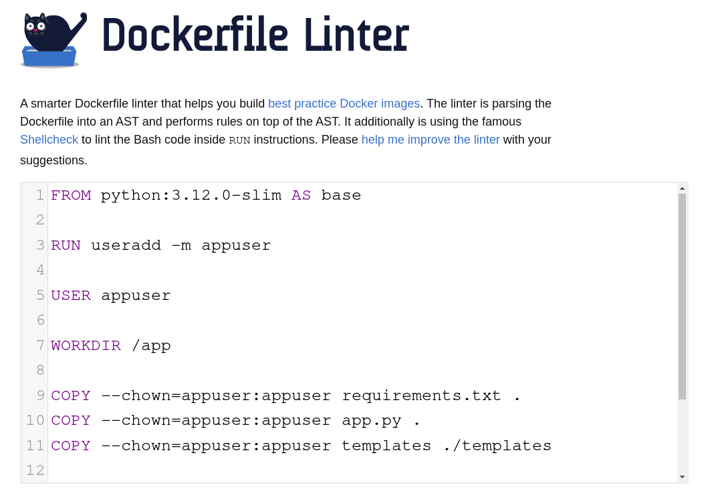
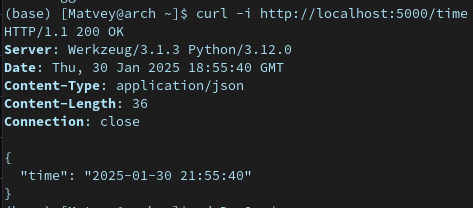
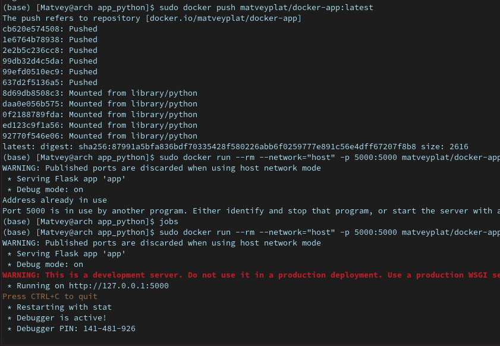

# How to run

## Please follow this steps to run this application

1. run command **pip install -r requirements.txt**
2. run command **python app.py**
3. follow **<http://127.0.0.1:5000>** on your web browser

# Docker Section

## Steps for running app using docker

1. run next command in application folder:  **docker build -t docker-app .** (use **sudo** for this and next commands if it necessary)

2. run command **docker run --rm --network="host" -p 5000:5000 --name docker-app docker-app**

3. or you can skip above steps andjust type **sudo docker run --rm --network="host" -p 5000:5000 matveyplat/docker-app\:latest** to retrieve and run image from DockerHub.

## Report part

- **Linting** Dockerfile:

- **Testing**:

- **Pushing** and **Pulling** from DockerHub:

# Unit Test Section

to run unit tests, simply run command **python -m unittest tests.py** in current directory.

# CI Workflow Section

## My workflow file contains 2 jobs:  build-and-test and docker-build-and-push

### build-and-test has next steps

1. Install dependencies for python
2. Snyk install using npm
3. Snyk auth with token
4. Run snyk test for app_python dir
5. Run snyk monitor
6. Run Linter flake8 for app_python dir
7. Run tests.py file for testing app.py

### docker-build-and-push has next steps

1. Login into Docker Hub
2. Building docker image
3. Pushing image to Docker Hub account
4. Snyk Security Scan of ima
