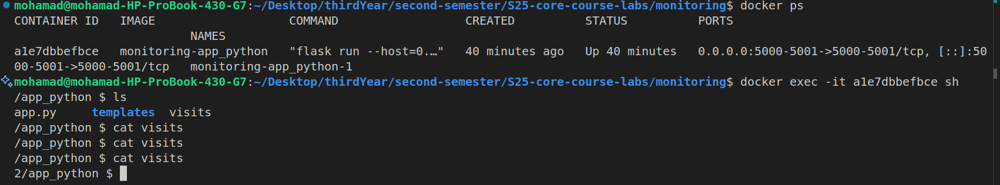

# Flask Web Application: Moscow Time

This is a simple web application that displays the current time in Moscow, Russia. The application is built using the Flask framework and follows best practices for Python web development.

---

## Table of Contents

1. [Overview](#overview)
2. [Prerequisites](#prerequisites)
3. [Installation](#installation)
4. [Running the Application](#running-the-application)
5. [Testing](#testing)
6. [Docker](#docker)
7. [Distroless Image Version](#distroless-image-version)
8. [Code Quality Checks](#code-quality-checks)
9. [Author](#author)

---

## Overview

The application displays the current time in the Moscow timezone (Europe/Moscow). It is built using Flask, a lightweight Python web framework, and uses pytz for timezone handling. Additionally, the application now includes a counter to track the number of times it has been accessed. The counter is stored in a visits file and can be viewed via the /visits endpoint.

---

## Prerequisites

Before proceeding, ensure you have the following installed:

- **Python 3.x**: Flask requires Python 3.6 or later. If you don't have Python installed, follow the official [Python installation guide](https://www.python.org/downloads/).
- **pip3**: Python's package installer. It usually comes preinstalled with Python.
- **Virtual Environment**: A virtual environment is recommended to isolate the project dependencies.

---

## Installation

### 1. Clone the Repository

Clone this repository to your local machine:

```bash
git clone git@github.com:Mohammed-Nour/S25-core-course-labs.git
cd S25-core-course-labs/app_python
```

### 2. Set Up a Virtual Environment

A virtual environment is used to isolate the application's dependencies. Follow the steps below to set it up:

#### Linux/macOS

1. Install the `venv` module (if not already installed):

    ```bash
    sudo apt install python3-venv
    ```

2. Create a virtual environment:

    ```bash
    python3 -m venv venv
    ```

3. Activate the virtual environment:

    ```bash
    source venv/bin/activate
    ```

#### Windows

1. Create a virtual environment:

    ```bash
    python -m venv venv
    ```

2. Activate the virtual environment:

    ```bash
    venv\Scripts\activate
    ```

### 3. Install Dependencies

Install the required dependencies using `pip`:

```bash
pip3 install -r requirements.txt
```

---

## Running the Application

1. Ensure the virtual environment is activated (you should see `(venv)` in your terminal prompt).
2. Set the `FLASK_APP` environment variable:
   - **Linux/macOS**:

     ```bash
     export FLASK_APP=app.py
     ```

   - **Windows**:

     ```bash
     set FLASK_APP=app.py
     ```

3. Run the Flask application:

   ```bash
   flask run
   ```

4. Open your browser and navigate to `http://127.0.0.1:5000/`.

   > **Note**: The application will start a development server on `http://127.0.0.1:5000/`. You can stop the server by pressing `Ctrl+C` in the terminal.

5. Open your browser and navigate to `http://127.0.0.1:5000/visits` to see the visits counter.



---

## Testing

To ensure the application works correctly:

1. Run the application and verify that the displayed time matches the current time in Moscow.
2. Refresh the page to confirm that the time updates dynamically.

---

## Docker

This application is containerized using Docker, following best practices for building and running Docker images.

### How to Build the Docker Image

1. Navigate to the `app_python` directory:

   ```bash
   cd S25-core-course-labs/app_python
   ```

2. Build the Docker image:

   ```bash
   docker build -t oshaheen1882051/app_python:app_python-prod-1.0.0 --no-cache=True .
   ```

   - The `--no-cache=True` flag ensures a clean build by ignoring cached layers.

### How to Run the Docker Image

1. Run the Docker container:

   ```bash
   docker run -d -p 5000:5000 --name app_python oshaheen1882051/app_python:app_python-prod-1.0.0
   ```

2. Access the application at `http://localhost:5000`.

### How to Push the Docker Image to Docker Hub

1. Log in to Docker Hub (if not already logged in):

   ```bash
   docker login
   ```

2. Push the Docker image:

   ```bash
   docker push oshaheen1882051/app_python:app_python-prod-1.0.0
   ```

### How to Pull the Docker Image from Docker Hub

1. Pull the Docker image:

   ```bash
   docker pull oshaheen1882051/app_python:app_python-prod-1.0.0
   ```

2. Run the container as described in the "How to Run the Docker Image" section.

---

## Distroless Image Version

This application is also available in a **Distroless** version, which is a minimal Docker image that only includes the application and its runtime dependencies, without unnecessary tools or package managers.

### How to Build the Distroless Docker Image

1. Navigate to the `app_python` directory:

   ```bash
   cd S25-core-course-labs/app_python
   ```

2. Build the Distroless Docker image:

   ```bash
   docker build -t oshaheen1882051/app_python:app_python-distroless-prod-1.0.0 --file distroless.Dockerfile --no-cache=True .
   ```

   - The `--file distroless.Dockerfile` flag specifies the custom Dockerfile for the Distroless build.
   - The `--no-cache=True` flag ensures a clean build by ignoring cached layers.

### How to Run the Distroless Docker Image

1. Run the Distroless Docker container:

   ```bash
   docker run -d -p 5000:5000 --name app_python_distroless oshaheen1882051/app_python:app_python-distroless-prod-1.0.0
   ```

2. Access the application at `http://localhost:5000`.

### How to Push the Distroless Docker Image to Docker Hub

1. Log in to Docker Hub (if not already logged in):

   ```bash
   docker login
   ```

2. Push the Distroless Docker image:

   ```bash
   docker push oshaheen1882051/app_python:app_python-distroless-prod-1.0.0
   ```

### How to Pull the Distroless Docker Image from Docker Hub

1. Pull the Distroless Docker image:

   ```bash
   docker pull oshaheen1882051/app_python:app_python-distroless-prod-1.0.0
   ```

2. Run the container as described in the "How to Run the Distroless Docker Image" section.

---

## Code Quality Checks

To ensure the code adheres to best practices and coding standards, the following tools are used:

### 1. **Pylint**

Pylint is a static code analysis tool that checks for errors, enforces coding standards, and provides suggestions for improving code quality.

Run Pylint on the `app.py` file:

```bash
pylint app.py
```

### 2. **Flake8**

Flake8 is a tool that combines PyFlakes, pycodestyle, and McCabe complexity checks to ensure the code follows PEP 8 standards and is free of common errors.

Run Flake8 on the `app.py` file:

```bash
flake8 app.py
```

---

## Author

- **Name**: Mohamad Nour Shahin
- **Email**: <mo.shahin@innopolis.university>
