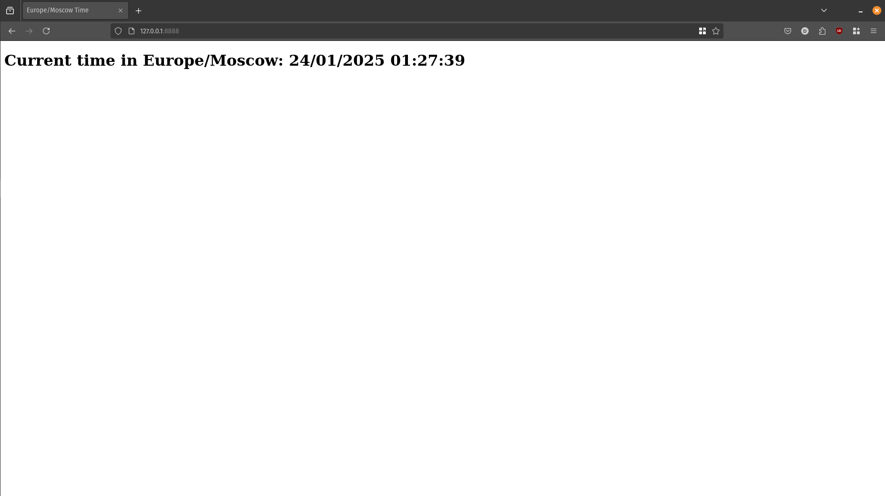

# Python Web Application

## 📘 Overview

This is a simple web application that is built using Python and FastAPI to show the current time in Moscow (UTC+3)!



---

## 💻 Local Installation

### Prerequisites

The project requires you to have:

- python3 (tested on 3.10)
- pip
- make (optional, just directly run the commands inside `Makefile`, if it is not available)

### Installation Steps

1. Clone the repository:

   ```bash
   git clone https://github.com/MagicWinnie/S25-core-course-labs
   git checkout lab1
   cd S25-core-course-labs/app_python
   ```

2. Create a python virtual environment:

   ```bash
   python -m venv .venv
   source .venv/bin/activate
   ```

3. Install the requirements:

   ```bash
   pip install -r requirements.txt
   ```

4. Run the application:

   ```bash
   make run
   ```

5. Navigate to <http://127.0.0.1:8888>.

---

## 🛠️ Development

- Install the development requirements:

   ```bash
   pip install -r requirements-dev.txt
   ```

- Format the code:

   ```bash
   make format
   ```

- Statically check the code using black, isort, pylint, and mypy:

   ```bash
   make check
   ```
