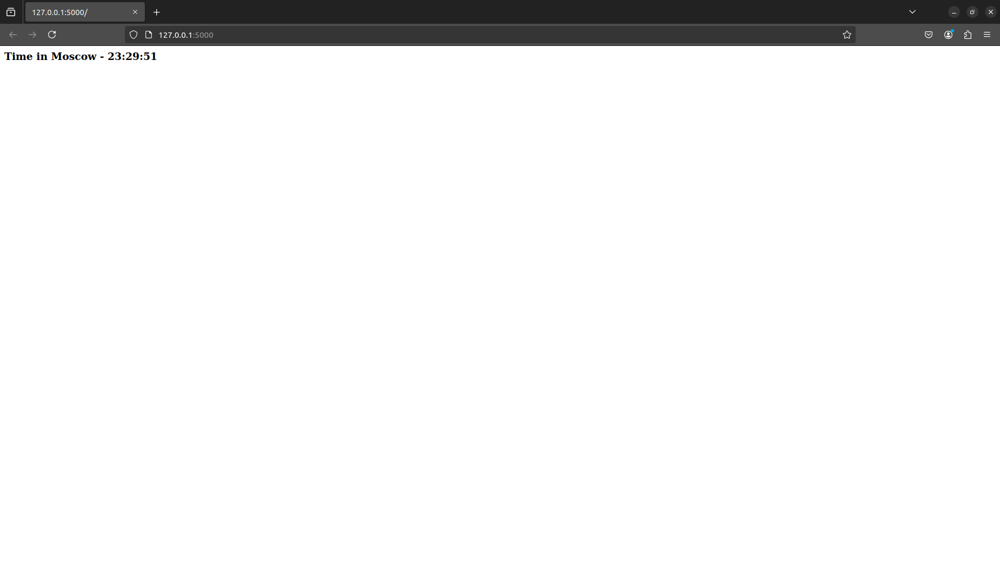

# Moscow Time Web App

## Overview

[](https://github.com/azzyyzz/S25-core-course-labs/actions/workflows/app_python.yml)

Simple Python web app to show time in Moscow.



## Installation

```bash
git clone -b lab2 https://github.com/azzyyzz/S25-core-course-labs.git
cd S25-core-course-labs/app_python
```

## Requitements

- [Python](https://www.python.org/downloads/) 3.7+
- [pip](https://pip.pypa.io/en/stable/installation/) 22.0.2+

## Usage

```bash
pip install -r requirements.txt
python3 app.py
```

## Docker

### Clone and build the Docker Image

```bash
git clone -b lab2 https://github.com/azzyyzz/S25-core-course-labs.git
cd S25-core-course-labs/app_python
docker build -t azeeeez/python_moscow_time .
```

### Pull and Run the Docker Image from Docker Hub

```bash
docker pull azeeeez/python_moscow_time
docker run -p 5000:5000 azeeeez/python_moscow_time
```

The app should be running on `localhost:5000`

### Distroless

You can find distroless image in this [link](https://hub.docker.com/repository/docker/azeeeez/python_moscow_time_dist/general)

## Unit Tests

Unit tests are implemented using the `unittest` framework for the Python application.
