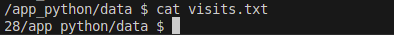

# Flask Web App: Moscow Time

## Overview

This is a simple Python Flask web application that displays the **current time in Moscow**. The time updates every time the user refreshes the page, and is accurately timezone-adjusted using `pytz`, it can also count how many visits it got and save it in the `visit.txt` file. The app also tracks and displays how many times it has been accessed across all visits.

---

## Prerequisites

Before you begin, ensure you have the following installed:

- Python 3.8 or higher
- pip (Python package manager)

(Optional but recommended):
- A virtual environment tool such as `venv`

---

## Installation

Clone the repository or download the project files and navigate to the project directory:

```bash
cd app_python
```

Create and activate a virtual environment (recommended):

```bash
python -m venv venv
source venv/bin/activate
```

Install the required dependencies:

```bash
pip install -r requirements.txt
```

---

## Running the Application

To start the Flask web server:

```bash
python app.py
```

Then open your browser and visit:

```
http://127.0.0.1:5000
```

Refresh the page to see the current time update in real-time.


---

## Endpoints
- `/` – Displays the current time in Moscow and shows the total visit count.
- `/visits` – Returns just the raw number of total visits.
### Persistence

When using Docker Compose, the `visits.txt` file is saved to the host machine using a volume.

## Testing

I used **manual testing** and **code linting** to ensure quality:

### Manual Testing
How did I test it:
- Load the page and verify the current time is shown.
- Refresh the page to confirm the time updates.
- Confirm proper timezone formatting for Moscow.

### Code Quality Checks

Run these tools to check for linting and code quality:

```bash
flake8 app.py
python3 -m pylint app.py
```

---
## Docker

This application is containerized using Docker.

### How to Build

From the project directory, build the Docker image:

```bash
docker build -t alimansour000/moscow-time-app:latest .
```

### How to Pull

To use the image from Docker Hub:

```bash
docker pull alimansour000/moscow-time-app:latest
```

### How to Run

Run the Docker container:

```bash
docker run -p 5000:5000 alimansour000/moscow-time-app:latest
```

Then open your browser and visit:

```
http://127.0.0.1:5000
```

---

##  Unit Tests

This project includes unit tests using `pytest` to validate route behavior.

### Run Tests Locally

```bash
pip install pytest
pytest
```
Tests include:

- Verifying the / route returns a 200 status code

- Confirming the homepage contains "Current Time in Moscow"


---

## 🛠 Continuous Integration (CI)

This project uses GitHub Actions for CI/CD.

### CI Workflow Steps:
- Checkout and set up Python 3.12
- Cache and install dependencies
- Run linters: `flake8`, `pylint`
- Run unit tests: `pytest`
- Build and push Docker image (using Docker Buildx)
- Scan code and dependencies with **Snyk** for vulnerabilities

### Docker Hub:
📦 [alimansour000/moscow-time-app](https://hub.docker.com/r/alimansour000/moscow-time-app)