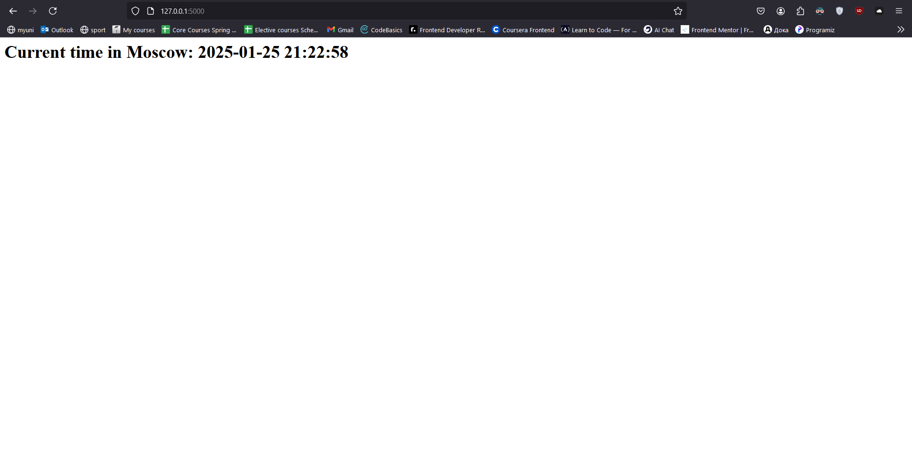
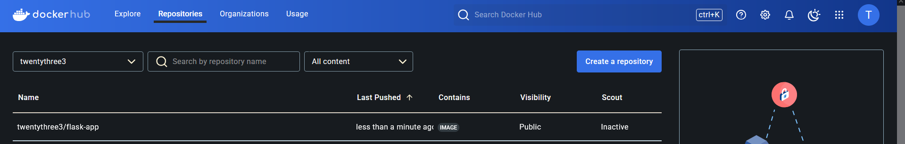
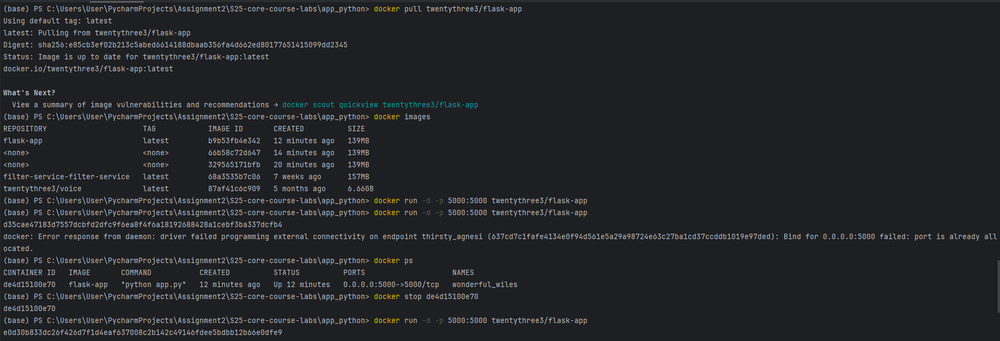

# Flask Application

This is a simple Flask application that displays the current time in Moscow.

# Docker Instructions

# How to Build the Docker Image
To build the Docker image locally:
```bash
docker build -t flask-app .
```

# How to Pull the Docker Image
To pull the Docker image from Docker Hub:

```bash
docker pull twentythree3/flask-app
```

# How to Run the Docker Image
To run the container locally after building or pulling:

```bash
docker run -d -p 5000:5000 twentythree3/flask-app
```

You can then access the application in your browser at: [link](http://localhost:5000)

# Features
- Displays the current time in Moscow.
- Lightweight Docker image.
- Runs securely as a non-root container.


Screenshots:


DockerHub:


Pull and run image from docker hub:


