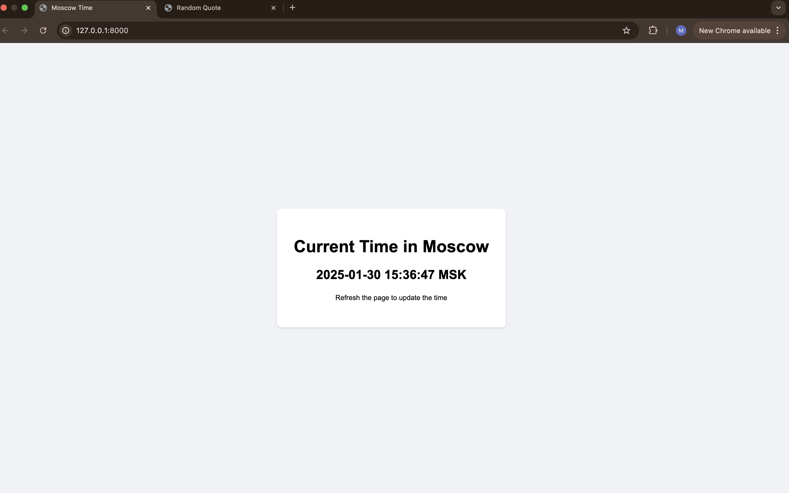

# Moscow Time Web Application

## Overview

A simple web application built with FastAPI that displays the current time in Moscow. The application updates the time when the page is refreshed and features a clean, minimalist interface.

## Features

- Displays current Moscow time in real-time
- Automatic time zone handling using pytz
- Clean and responsive UI
- Error handling for robustness

## Prerequisites

- Docker installed on your system
OR
- Python 3.8+
- pip package manager

## Installation

### Using Docker (Recommended)

1. Pull the image from Docker Hub:

    ```bash
    docker pull haidarjbeily/moscow-time-app
    # or
    docker pull haidarjbeily/distroless-moscow-time-app:latest
    ```

2. Run the container:

    ```bash
    docker run -p 8000:8000 -t haidarjbeily/moscow-time-app
    # or
    docker run -p 8000:8000 -t haidarjbeily/distroless-moscow-time-app:latest
    ```

### Manual Installation

1. Install dependencies:

    ```bash
    pip install -r requirements.txt
    ```

2. Run the application:

    ```bash
    uvicorn main:app --reload
    ```

### Building Docker Image Locally

If you want to build the Docker image yourself:

1. Clone the repository
2. Build the regular image:

    ```bash
    docker build -t moscow-time-app .
    ```

    Or build the distroless image (recommended for production):

    ```bash
    docker build -t moscow-time-app-distroless -f distroless.Dockerfile .
    ```

3. Run the container (regular):

    ```bash
    docker run -p 8000:8000 -t moscow-time-app
    ```

   Or run the distroless container:

    ```bash
    docker run -p 8000:8000 -t moscow-time-app-distroless
    ```

## Usage

- Open your web browser and navigate to `http://localhost:8000`.
- The application displays the current time in Moscow.
- The time is updated automatically when the page is refreshed.




## Unit Tests

The application includes comprehensive unit tests to ensure reliability and functionality:

### Test Coverage

- Endpoint functionality testing
- Time zone validation
- Template rendering verification
- Error handling scenarios

### Running Tests

1. Install test dependencies:

    ```bash
    pip install -r requirements.txt
    ```

2. Run tests:

    ```bash
    pytest
    ```

3. Run with coverage report

```bash
pytest --cov=. tests/
```

### Test Structure

- `/tests` - Contains all test files
- `test_main.py` - Core application tests
- `pytest.ini` - Test configuration

Tests follow best practices including isolation, clear naming, and comprehensive assertions.
