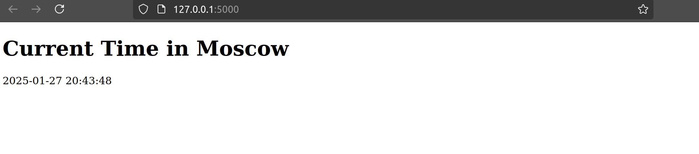

# Moscow Time Web App

Displays current Moscow time (MSK) using Python/Flask.


## Quick Start
```bash
git clone https://github.com/VilaPat7/S25-core-course-labs.git
git checkout lab1
cd app_python

# Install dependencies
pip install -r requirements.txt

# Run app
python3 app.py
```
Open http://localhost:5000 in browser. Refresh page to update time.

## Features
- Real-time MSK timezone
- Simple Flask implementation
- Auto HTML escaping
- Version-pinned dependencies

## Run with Docker

This application is Dockerized for easy deployment. Follow the steps below to run it using Docker.

### Prerequisites

Docker must be installed on your system. 

### How to Build the Docker Image
```bash
sudo docker build -t vika123vika/app-python:latest .
```

### How to Pull the Docker Image from Docker Hub
```bash
sudo docker pull vika123vika/app-python:latest
```

### How to Run the Docker Container
```bash
sudo docker run -p 5000:5000 vika123vika/app-python:latest
```

### Go to localhost:
Open http://localhost:5000 in browser.

## Unit Tests

This project includes unit tests to ensure the correct functionality of the core features.

### Running Unit Tests
To execute the tests locally, use the following command:

```bash
PYTHONPATH=$(pwd) python3 -m unittest discover app_python/tests -v
```

## CI/CD Workflow

This project uses GitHub Actions for automated testing and Docker deployment.

### CI/CD Steps:
1. **Install dependencies** – Ensures all required packages are available.
2. **Run linter (flake8)** – Checks code for style issues.
3. **Run unit tests** – Executes all unit tests.
4. **Login to Docker Hub** – Authenticates with Docker registry.
5. **Build & push Docker image** – Creates and pushes a new image.

## CI/CD Status


The workflow runs automatically on every `push` and `pull request`.

