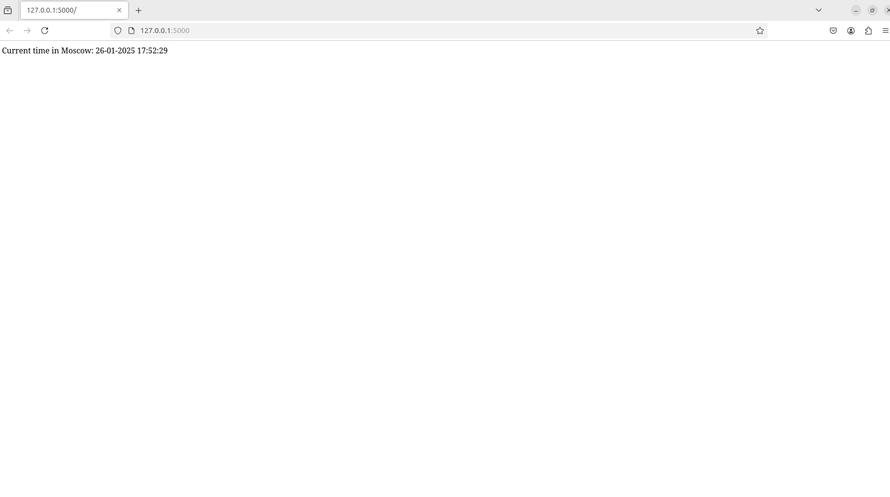
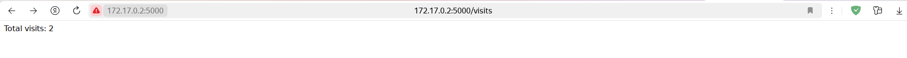

# Python Web App

## Description

This is a Python web application that shows the current time in Moscow.



-----

## How to install it locally?

### Prerequisites

The project requires:

- python3 (3.8 or later)
- pip

### Installation

1. Clone the repo:

   ```bash
   git clone https://github.com/BugaevGleb/S25-core-course-labs
   cd S25-core-course-labs
   git checkout lab1
   cd app_python
   ```

2. Create a virtual environment:

   ```bash
   python3 -m venv .venv
   source .venv/bin/activate
   ```

3. Install the requirements:

   ```bash
   pip install -r requirements.txt
   ```

4. Run the application:

   ```bash
   python3 app.py
   ```

5. Go to <http://127.0.0.1:5000> and see the current Moscow time.

-----

## Docker

### Basic Image Version

This application is containerized using the Docker. To build, pull and push the application, follow these steps:

1. Build and run the Docker image for the application:

   ```bash
   git clone https://github.com/BugaevGleb/S25-core-course-labs
   cd S25-core-course-labs
   git checkout lab2
   cd app_python
   ```

   ```bash
   docker build -t python-msk-time-app:1.0 .
   ```

   ```bash
   docker run -p 5000:5000 python-msk-time-app:1.0
   ```

2. Pull the image from the Docker Hub:

   ```bash
   docker pull bugay/python-msk-time-app:1.0
   ```

3. Run the application:

   ```bash
   docker run -p 5000:5000 bugay/python-msk-time-app:1.0
   ```

4. Go to <http://127.0.0.1:5000> and see the current Moscow time.

-----

### Distroless Image Version

This application also is containerized using the Docker as an Distroless image (in order to increase a security aspect and decrease a size of an image). To build, pull and push the application, follow these steps:

1. Build and run the Docker image for the application:

   ```bash
   git clone https://github.com/BugaevGleb/S25-core-course-labs
   cd S25-core-course-labs
   git checkout lab2
   cd app_python
   ```

   ```bash
   docker build -t python-msk-time-app-distroless:1.0 -f distroless.Dockerfile .
   ```

   ```bash
   docker run -p 5000:5000 python-msk-time-app-distroless:1.0
   ```

2. Pull the image from the Docker Hub:

   ```bash
   docker pull bugay/python-msk-time-app-distroless:1.0
   ```

3. Run the application:

   ```bash
   docker run -p 5000:5000 bugay/python-msk-time-app-distroless:1.0
   ```

4. Go to <http://127.0.0.1:5000> and see the current Moscow time.

-----

### Unit Tests

After steps 1-3 of `Installation` section, run the following command to run tests localy:

```bash
python3 -m unittest discover -s tests
```

-----

### CI Workflow

[](https://github.com/BugaevGleb/S25-core-course-labs/actions)

For this project the CI is configured using GitHub actions. CI Workflow consists of the following steps:

- Checkout the repository
- Set up Python environment
- Cache dependencies
- Install dependencies
- Run Linter
- Run Unit Tests
- Snyk Vulnerability Check
- Log in to Docker Hub
- Build and Push Docker Image
- Build and Push Docker Distroless Image

-----

### Visits Endpoint

I setted up an endpoint `/visits` for Python application on which you can see the number of accesses from the users to this application. Each time user accesses the application, it increments visits counter in `data/visits` file, and reads from it while user accesses `/visits` endpoint. Using `docker-compose.yml` I mounts `data` folder with `visits` file on the host to persist `visits` counter.



-----
