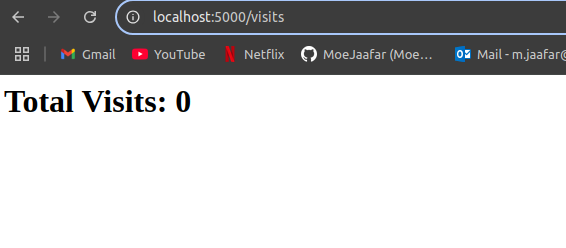
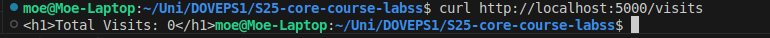

# 🌟 Moscow Time Web Application

## ✅ Status


## 📚 Overview

This is a Flask-based web application that displays the current time in Moscow. It is fully containerized with **Docker** and automated using **GitHub Actions CI/CD**.

---

## 🚀 Features

- 🌍 Displays real-time **Moscow time (MSK)**
- ⚡ Built with **Flask** – lightweight and efficient
- 🔄 **GitHub Actions CI/CD enabled** (Linting, Testing, Docker Build & Push)
- 🧪 **Automated Unit Testing**
- 🛠️ **Dockerized for easy deployment**
- 🛡️ **Security Scans with Snyk**

---

## 📚 Project Structure

```bash
app_python/
│── app.py              # Main Flask application
│── requirements.txt    # Dependencies
│── PYTHON.md           # Justification & Best Practices
│── README.md           # Documentation
│── DOCKER.md           # Docker documentation
│── Dockerfile          # Docker container setup
│── tests/              # Unit tests
│   ├── test_app.py     # Test cases for Flask app
│── .github/workflows/  # CI/CD workflows
```

---

## 🏰 Installation & Setup

### **1️⃣ Clone the Repository**

```bash
git clone https://github.com/MoeJaafar/S25-core-course-labs.git
cd app_python
```

### **2️⃣ Set Up a Virtual Environment (Recommended)**

```bash
python -m venv venv
```

#### **Activate Virtual Environment:**

- **Windows:**

  ```bash
  venv\Scripts\Activate
  ```

- **Mac/Linux:**

  ```bash
  source venv/bin/activate
  ```

### **3️⃣ Install Dependencies**

```bash
pip install -r requirements.txt
```

---

## ▶️ Running the Application

Once dependencies are installed, start the Flask application:

```bash
python app.py
```

The server will run on **[http://127.0.0.1:5000/](http://127.0.0.1:5000/)**. Open your browser and visit this URL to see the Moscow time.

---

## 📝 API Endpoint

| Method | Endpoint | Description                         |
| ------ | -------- | ----------------------------------- |
| `GET`  | `/`      | Returns the current **Moscow time** |

---

## 🧪 Unit Testing

### **Run Tests Locally**

```bash
python -m unittest discover tests
```

### **GitHub Actions CI/CD Includes:**

✅ **Dependency Installation**  
✅ **Linting with `flake8`**  
✅ **Running Unit Tests**  
✅ **Building & Pushing Docker Image**  
✅ **Security Checks with Snyk**  

---

## 🛠️ Docker Instructions

### **1️⃣ Build the Docker Image**

```bash
docker build -t YOUR_DOCKER_USERNAME/moscow-time-app .
```

### **2️⃣ Run the Container**

```bash
docker run -p 5000:5000 YOUR_DOCKER_USERNAME/moscow-time-app
```

### **3️⃣ Push the Image to Docker Hub**

```bash
docker tag YOUR_DOCKER_USERNAME/moscow-time-app YOUR_DOCKER_USERNAME/moscow-time-app:latest
docker push YOUR_DOCKER_USERNAME/moscow-time-app:latest
```

### **4️⃣ Pull the Image from Docker Hub**

```bash
docker pull YOUR_DOCKER_USERNAME/moscow-time-app:latest
```

---

## 🔄 CI/CD Pipeline with GitHub Actions

This project is **automated with CI/CD** using GitHub Actions.  
**CI Workflow Includes:**

1. **Linting** → Checks Python code formatting
2. **Testing** → Runs unit tests automatically
3. **Docker Build & Push** → Pushes latest image to **Docker Hub**
4. **Security Checks** → Scans for vulnerabilities using Snyk

**🔹 GitHub Actions Workflow File:**

```yaml
name: Python CI

on:
  push:
    branches: [ main, lab3 ]
  pull_request:
    branches: [ main, lab3 ]

jobs:
  build:
    runs-on: ubuntu-latest

    steps:
      - name: Checkout Code
        uses: actions/checkout@v3

      - name: Set up Python
        uses: actions/setup-python@v4
        with:
          python-version: "3.9"

      - name: Install Dependencies
        run: |
          pip install -r requirements.txt

      - name: Run Linter
        run: |
          pip install flake8
          flake8 app_python/

      - name: Run Tests
        run: python -m unittest discover tests

      - name: Docker Login
        run: echo "${{ secrets.DOCKER_PASSWORD }}" | docker login -u "${{ secrets.DOCKER_USERNAME }}" --password-stdin

      - name: Docker Build & Push
        run: |
          docker build -t YOUR_DOCKER_USERNAME/moscow-time-app:latest .
          docker push YOUR_DOCKER_USERNAME/moscow-time-app:latest
```

---

## 📌 Deployment Options

This Flask app supports **multiple deployment methods**:

### **🔹 1. Docker Hub Deployment**

- CI/CD automatically builds and pushes the image to **Docker Hub**.
- To pull and run the latest version:

  ```bash
  docker run -p 5000:5000 YOUR_DOCKER_USERNAME/moscow-time-app:latest
  ```

### **🔹 2. Cloud Deployment (Optional)**

This app is **ready for deployment** on:

- **Heroku**
- **AWS (ECS, Lambda, Elastic Beanstalk)**
- **Google Cloud Run**
- **Kubernetes (K8s)**

---

## 🛡️ Best Practices Followed

- ✅ **PEP 8 Compliance** (Python Coding Standards)
- ✅ **Virtual Environment for Dependency Management**
- ✅ **Structured Project Files**
- ✅ **Automated CI/CD with GitHub Actions**
- ✅ **Unit Testing with `unittest`**
- ✅ **Dockerized for Portability**
- ✅ **Security Scans with Snyk**

---

## 📝 Author

- **Mohammad Jaafar**
- 📧 [m.jaafar@innopolis.university](mailto:m.jaafar@innopolis.university)
- 👉 [GitHub Profile](https://github.com/MoeJaafar)


## **Application Upgrade: Visit Counter and Persistent Storage**

### **Overview**
In this upgrade, we enhanced the application by introducing a **visit counter** that tracks the number of times the application has been accessed. The counter is stored persistently in a **visits.txt** file, ensuring that visit data is retained even after container restarts.

---

### **Key Enhancements**
1. **Implemented a Visit Counter:**
   - Each time the root (`/`) endpoint is accessed, the visit count increases.
   - The count is stored in a file instead of memory to persist across restarts.

2. **Introduced a New `/visits` Endpoint:**
   - Displays the total number of visits recorded in the file.

3. **Ensured Persistent Storage with Docker Volume:**
   - Mounted a persistent **`/data`** directory in the container.
   - The visit count is stored in `/data/visits.txt` to maintain data across deployments.

4. **Updated `docker-compose.yml`:**
   - Added a volume mapping `./data:/data` to persist the visits file outside the container.

---

### **How It Works**
1. The application initializes by checking if `visits.txt` exists inside `/data`.  
   - If not, it creates the file and starts the counter at **0**.
   
2. When a user accesses the main page (`http://localhost:5000/`):  
   - The visit counter increases.
   - The latest count is saved in `/data/visits.txt`.

3. Users can check the total visits at:  
   ```
   http://localhost:5000/visits
   ```

   
   - This returns the current visit count.

4. The container uses a volume to ensure the visit data is **not lost** when restarted.

---

### **Testing the Changes**
To verify that persistence works correctly:
```bash
# Stop and remove all containers
docker-compose down

# Start the container again
docker-compose up -d

# Check the visits count
curl http://localhost:5000/visits
```
   

- The count should **persist** across restarts.

---

