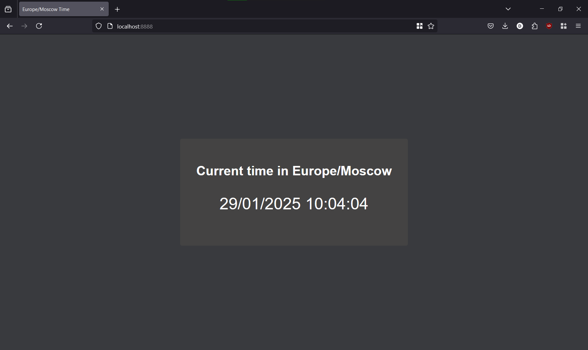

# Python Web Application

[](https://github.com/MagicWinnie/S25-core-course-labs/actions/workflows/app_python.yml)

## 📘 Overview

This is a simple web application that is built using Python and FastAPI to show the current time in Moscow (UTC+3)!



---

## 🔄 CI/CD

This project uses GitHub Actions for CI/CD to automate testing, security scanning, and Docker image building. The workflow is triggered on pull requests to `master` branch when changes occur in the `app_python/` directory.

You can view workflow runs [here](https://github.com/MagicWinnie/S25-core-course-labs/actions/workflows/app_python.yml).

---

## 🗺️ Visits Counter

An endpoint `/visits` has been added that maintains a counter of how many times the application was accessed.

Each time the root endpoint of the application is accessed, the application reads the current count from a file `visits/visits.txt`, increments it, and writes the new value back.

`docker-compose.yml` file mounts a host directory to persist the `visits.txt` file.

## 💻 Local Installation

### Prerequisites

The project requires you to have:

- python3 (tested on 3.10)
- pip
- make (optional, just directly run the commands inside `Makefile`, if it is not available)

### Installation Steps

1. Clone the repository:

   ```bash
   git clone https://github.com/MagicWinnie/S25-core-course-labs
   git checkout lab1
   cd S25-core-course-labs/app_python
   ```

2. Create a python virtual environment:

   ```bash
   python -m venv .venv
   source .venv/bin/activate
   ```

3. Install the requirements:

   ```bash
   pip install -r requirements.txt
   ```

4. Run the application:

   ```bash
   make run
   ```

5. Navigate to <http://127.0.0.1:8888>.

---

## 🐳 Docker

### Distro-based Image Version

Containerized version of the web application:

- uses Alpine version of Python 3.10;
- installs the application in `/app` directory;
- creates a nonroot user `user`;
- runs the application on port `8000`.

#### How to build?

   ```bash
   # clone the repository
   git clone https://github.com/MagicWinnie/S25-core-course-labs
   git checkout lab2
   cd S25-core-course-labs/app_python
   # build the image
   docker build -t simple-python-web-app .
   # run a container
   docker run -p 8888:8000 simple-python-web-app
   ```

#### How to pull?

   ```bash
   docker pull magicwinnie/simple-python-web-app:latest
   ```

#### How to run?

   ```bash
   docker run -p 8888:8000 magicwinnie/simple-python-web-app:latest
   ```

---

### Distroless Image Version

Containerized version of the web application:

- uses `python:3.11-slim-bookworm` and `gcr.io/distroless/python3-debian12:nonroot`;
- installs the application in `/app` directory;
- uses a nonroot tag;
- runs the application on port `8000`.

#### How to build?

   ```bash
   # clone the repository
   git clone https://github.com/MagicWinnie/S25-core-course-labs
   git checkout lab2
   cd S25-core-course-labs/app_python
   # build the image
   docker build -t simple-python-web-app-distroless -f distroless.Dockerfile .
   # run a container
   docker run -p 8888:8000 simple-python-web-app-distroless
   ```

#### How to pull?

   ```bash
   docker pull magicwinnie/simple-python-web-app-distroless:latest
   ```

#### How to run?

   ```bash
   docker run -p 8888:8000 magicwinnie/simple-python-web-app-distroless:latest
   ```

---

## 🛠️ Development

- Install the development requirements:

   ```bash
   pip install -r requirements-dev.txt
   ```

- Format the code:

   ```bash
   make format
   ```

- Statically check the code using black, isort, pylint, and mypy:

   ```bash
   make check
   ```

### Unit Tests

Pytest is used for testing. Tests can be run using `Makefile`:

```bash
make test
```
