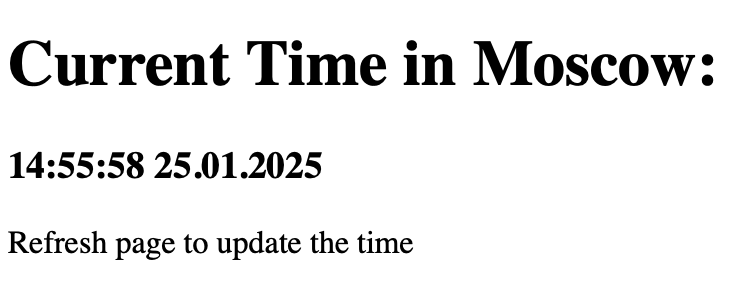

# Python Moscow Time Web App

### Developer

[Arseny Savchenko](https://github.com/dinaraparanid)

### About App

Sample Flask web application that shows current time in Moscow.
Application utilizes [unittest](https://docs.python.org/3/library/unittest.html)
to ensure the accuracy of the results, regardless of network conditions.

### Preview

### Setup

* **Manual**

Build application with python interpreter:

1. Optional: create virtual environment:
   > python3 -m venv /path/to/venv

2. Install all necessary dependencies from the requirements.txt:
   > pip install -r requirements.txt

3. Run application on the localhost:
   > python3 app.py

* **Docker (Base Image)**

Build application with Docker (base image):

1. Pull image from DockerHub:
   > docker pull paranid5/app_piton

2. Run docker container:
   > docker run --rm -it -p <YOUR_PORT>:8080 paranid5/app_piton

3. Access web page:
   > curl http://127.0.0.1:<YOUR_PORT>

4. Optional: build image with Dockerfile:
   > docker build -t app_piton

* **Docker (Distroless Image)**

Build application with minimized Docker image:

1. Pull image from DockerHub:
   > docker pull paranid5/app_piton_dist

2. Run docker container:
   > docker run --rm -it -p <YOUR_PORT>:8080 paranid5/app_piton_dist

3. Access web page:
   > curl http://127.0.0.1:<YOUR_PORT>

4. Optional: build image with Dockerfile:
   > docker build -t app_piton_dist -f distroless.Dockerfile .

### Stack

<ul>
   <li>Python 3.9</li>
   <li>Flask 3.1.0</li>
   <li>Pytz 2024.2</li>
</ul>
