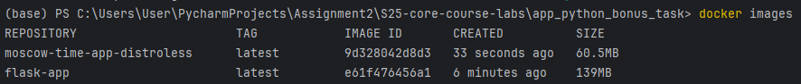

## Distroless Image Version

### Advantages of Using Distroless Images:
1. The Distroless image is significantly smaller, leading to faster pull times and lower storage usage.
2. The absence of a shell, package manager, and root user reduces the attack surface.
3. Minimal dependencies reduce runtime overhead.

### How to Use the Distroless Image:
1. Build the image:
```bash
   docker build -t moscow-time-app-distroless -f Distroless.Dockerfile .
```

2. Run the image:
```bash
docker run -p 5001:5001 moscow-time-app-distroless
```

### Screenshot 


