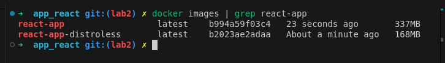

# Docker Implementation

## Distroless vs Standard Image Comparison

### Size Comparison
- Standard Node.js image: 337MB
- Distroless image: 168MB
- Reduction in size: ~50%

### Benefits of Distroless
1. Smaller image size (337MB → 168MB)
2. Improved security due to:
   - Only runtime dependencies
   - No shell or package managers
3. Faster deployment due to smaller size

### Implementation Details
1. Standard Image:
   - Based on node:18-slim
   - Contains full Node.js environment
   - Includes package managers and shell

2. Distroless Image:
   - Uses multi-stage build
   - Contains only Node.js runtime
   - No shell access

