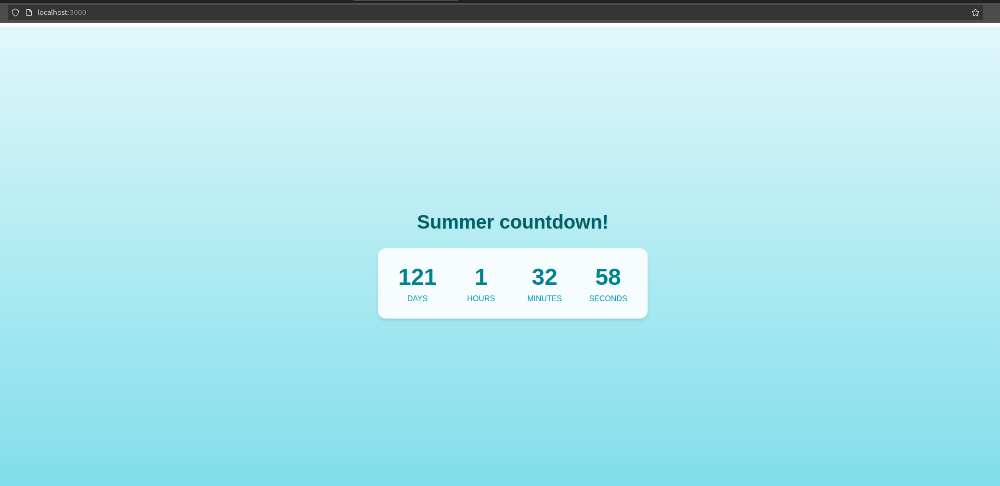

# Summer Countdown Application

## Overview
React application displaying a countdown timer until the start of summer (June 1st)

## Features
- Real-time countdown timer
- Automatic updates every second

## Tech Stack
- React with TypeScript
- Vite for build tooling
- Pure CSS

## Local Installation

### Prerequisites
- Node.js
- npm

### Setup Steps
1. Clone the repository
```bash
git clone https://github.com/dExNight/S25-core-course-labs.git
cd app_react
```

2. Install dependencies
```bash
npm install
```

3. Start development server
```bash
npm run dev
```

4. Access the application
Open your browser and navigate to `http://localhost:5173`

## Development
- Build for production: `npm run build`




# Docker Images

## Standard Image
```bash
# Build
docker build -t react-app .

# Run
docker run -p 3000:3000 react-app
```

## Distroless Version
```bash
# Build
docker build -t react-app-distroless -f distroless.Dockerfile .

# Run
docker run -p 3000:3000 react-app-distroless
```

