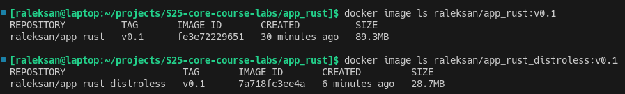

# Docker

## Docker Best Practices Used

### 1. Dockerfile linting

[hadolint](https://hadolint.github.io/hadolint/) linter was used to improve the readability, style, and security of the Dockerfile application.

### 2. Using a lightweight base image

I've used Rust Debian-based image with minimal size to enhance building speed, decrease final image size as well as number of vulnerabilities.

### 3. Pinned base image version

For this project, I chose the `rust:1.84-slim-bullseye` base image. Using a specific version ensures consistency.

### 4. Copying only specific files

I copied only the necessary files (`Rocket.toml`, `Cargo.tom`, and the `src` folder) into the container. This approach minimizes the container's attack surface by eliminating unnecessary files.

### 5. Rootless and UID-independent container

Following Docker security best practices, I created a rootless user named `app_user` and configured the container to run under that user.

### 6. Dockerignore

I implemented the `.dockerignore` file to exclude files that should not be part of the image build, such as local configuration files or secrets.

### 7. Miscellaneous improvements

- **Prefer COPY instead of ADD**: I used `COPY` to explicitly copy files instead of `ADD` since `COPY` is more predictable and conforms to best security practices.
- **Explicit EXPOSE**: I used the `EXPOSE 8000` directive to explicitly document the intended use of the container on the network.

## Distroless Image Version

I also built a Distroless image for a Rust application. The build process is described in `README.md`.

The resulting Distroless image is almost 50 MB (or almost 3 times) smaller than the original image. The Distroless base image excludes shells, package managers, and other OS features by default. However, some features, such as a shell, can be enabled by using the debug tag.

Since Rust is a compiled language, the final image only required the binary and static files. Additionally, I did not make any changes to the code.
