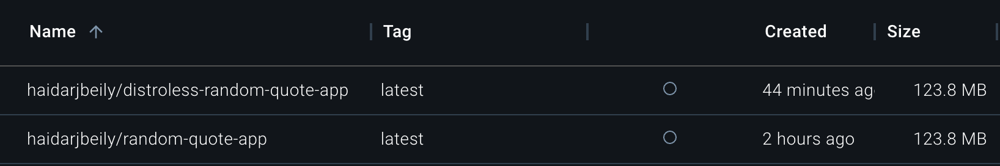

# Docker Implementation Details

## Best Practices Implemented

1. **Base Image Selection**
   - Using official Rust slim image for builder stage
   - Using minimal debian:bookworm-slim for runtime stage
   - Distroless alternative available for even smaller footprint

2. **Security**
   - Running as non-root user 'appuser' (UID: 10000)
   - Minimal permissions set
   - No sensitive data in image

3. **Layer Optimization**
   - Multi-stage build for minimal final image
   - Separate dependency build step to leverage cache
   - Cargo.toml and Cargo.lock copied first

4. **Build Efficiency**
   - Two-stage build process
   - Dependencies cached in separate layer
   - Only necessary runtime dependencies installed

5. **Image Size Optimization**
   - Slim-based images
   - Multi-stage build to exclude build tools
   - Minimal runtime dependencies

6. **Configuration**
   - Clear user permissions and workspace setup
   - Port 8080 exposed
   - Clear CMD instruction for application execution

7. **File Management**
   - Minimal file copying between stages
   - Proper WORKDIR usage (/build and /app)
   - Only necessary artifacts transferred to runtime image

8. **Documentation**
   - Well-commented Dockerfile
   - Both regular and distroless versions available

## Security Measures

- Non-root user with minimal permissions
- Multi-stage build isolation
- Minimal runtime dependencies
- Secure base images with regular updates

## Distroless Image Comparison

### Image Size Comparison

#### Regular Docker Image

- Builder: rust:1-slim-bullseye
- Runtime: debian:bookworm-slim
- Size: ~123MB
- Contains: Basic OS utilities, runtime libraries

#### Distroless Image

- Builder: rust:1-slim-bullseye
- Runtime: gcr.io/distroless/cc-debian11:nonroot
- Size: ~123MB
- Contains: Only necessary runtime components

## Key Differences

1. **Reduced Attack Surface**
   - Distroless has no shell access
   - No package manager in distroless
   - Minimal system libraries
   - No debugging tools

2. **Security Benefits**
   - Smaller attack surface in distroless
   - No ability to install additional packages
   - Reduced vulnerability footprint
   - Immutable runtime environment

3. **Production Ready**
   - Both versions optimized for production
   - Distroless offers enhanced security
   - Fast container startup times
   - Efficient resource utilization

