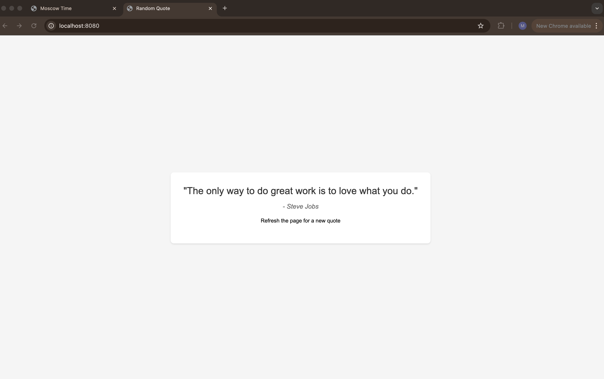

# Random Quote Web Application

## Overview

A simple web application built with Actix-web that displays random inspirational quotes. The application shows a new quote each time the page is refreshed and features a clean, minimalist interface.

## CI Status

[](https://github.com/HaidarJbeily7/s25-core-course-labs/actions/workflows/rust-app-ci.yml)

## Features

- Displays random inspirational quotes
- Clean and responsive UI
- Automatic quote rotation on page refresh
- Error handling for robustness

## Prerequisites

- Docker installed on your system
OR
- Rust 1.56 or higher
- Cargo package manager

## Installation

### Using Docker (Recommended)

1. Pull the regular image from Docker Hub:

    ```bash
    docker pull haidarjbeily/random-quote-app
    ```

   Or pull the distroless image for enhanced security:

    ```bash
    docker pull haidarjbeily/distroless-random-quote-app
    ```

2. Run the container (regular):

    ```bash
    docker run -p 8080:8080 -t haidarjbeily/random-quote-app
    ```

   Or run the distroless container:

    ```bash
    docker run -p 8080:8080 -t haidarjbeily/distroless-random-quote-app
    ```

### Manual Installation

1. Install dependencies:

    ```bash
    cargo build
    ```

2. Run the application:

    ```bash
    cargo run
    ```

### Building Docker Image Locally

If you want to build the Docker image yourself:

1. Clone the repository
2. Build the regular image:

    ```bash
    docker build -t random-quote-app .
    ```

   Or build the distroless image:

    ```bash
    docker build -f distroless.Dockerfile -t distroless-random-quote-app .
    ```

3. Run the container (regular):

    ```bash
    docker run -p 8080:8080 -t random-quote-app
    ```

   Or run the distroless container:

    ```bash
    docker run -p 8080:8080 -t distroless-random-quote-app
    ```

## Usage

- Open your web browser and navigate to `http://localhost:8080`
- The application displays a random inspirational quote
- Refresh the page to see a new quote



## Unit Tests

Tests follow best practices including isolation, clear naming, and comprehensive assertions.
The application includes comprehensive unit tests to ensure reliability and functionality:

### Test Coverage

- Endpoint functionality testing
- Quote generation validation
- Template rendering verification
- Error handling scenarios

### Running Tests

1. Install test dependencies:

    ```bash
    cargo test
    ```

2. Run with coverage report:

    ```bash
    cargo install cargo-tarpaulin
    cargo tarpaulin
    ```

## Continuous Integration

This project uses GitHub Actions for continuous integration. The CI pipeline includes the following steps:

### Build and Test Pipeline

- **Dependencies**: Installs Rust toolchain and dependencies
- **Linter**: Runs clippy to ensure code quality
- **Tests**: Executes cargo test suite

### Docker Pipeline

- **Login**: Authenticates with Docker Hub
- **Build & Push**: Builds and pushes Docker image to Docker Hub
