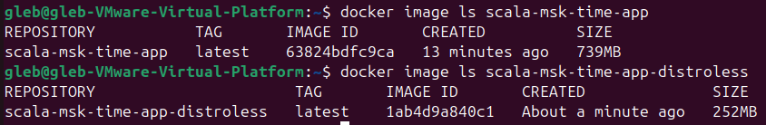

# Scala Web App - Docker Best Practices

## Linter

To ensure that Dockerfile is well-formatted and adheres most of best practices I used **hadolint** (installed on Ubunut and as an extension for Visual Studio Code).

-----

## Best Practices

1. **Non-Root User**: The container runs as a non-root user (`scala_user`) to achieve enhansed security.
2. **Layer Sanity**: By minimizing the number of layers and optimizing their order.
3. **Specific File Copying**: Only needed files (from `/src` and `/project`) are copied into the image.
4. **.dockerignore File**: Unnecessary files are excluded from the build context using `.dockerignore` and will not present in the built image.
5. **Precise Versioning**: The base image and dependencies are specified with concrete versions.
6. **Port Exposure**: The port for application (`9090`) is explicitly stated.

-----

## Differences between the distroless image and the usual image

1. **Images sizes**: The basic image `openjdk:17-jdk-slim` includes a minimal Linux distribution along with essential libraries required to run Java applications. The Distroless image `gcr.io/distroless/java17-debian11` is even more minimalistic. It excludes tools like a shell (`/bin/sh`), package managers, and other utilities, containing only the Java runtime and its dependencies. Therefore, the distroless image is about 3 times smaller that the basic image: 

2. **Security**: Reduced attack surface by excluding the shell and other utilities. This makes it harder for attackers (and even inattentive developers) to execute arbitrary commands or escalate privileges within the container.

3. **Debugging and Compatibility**: Due to absence of shell or common utilities in distroless image, it is more challenging to debug or imtagrate with another Python applications of tools, and may become possible only after some adjustments to the application and distroless.Dockerfile.

-----
