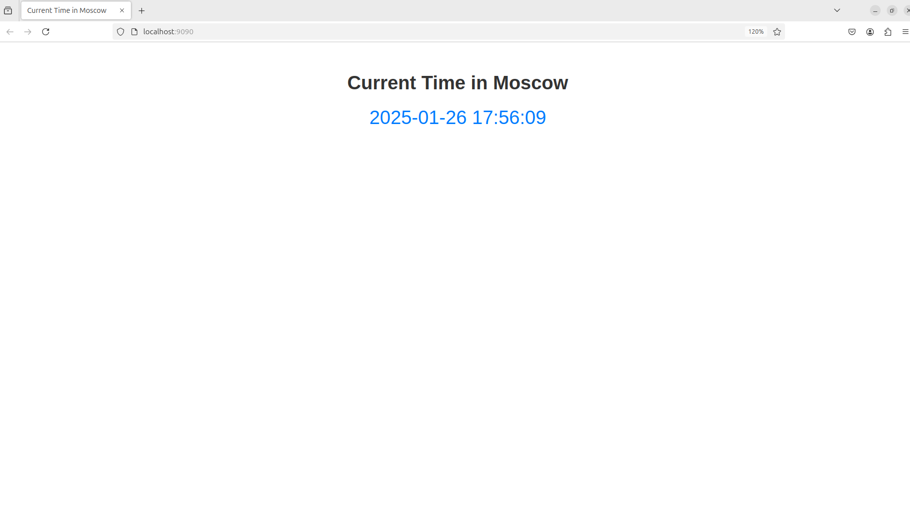

# Scala Web App

## Description

This is a Scala web application that shows the current time in Moscow.



-----

## How to install it locally?

### Requirements

The project requires:

- Scala 2.13.10
- SBT
- Java

All of it can be installed by requirements.sh bash file (included into the Installation steps). If Scala, Java and SBT are installed on your machine, skip the step of requirements installation.

### Installation

1. Clone the repo:

   ```bash
   git clone https://github.com/BugaevGleb/S25-core-course-labs
   cd S25-core-course-labs
   git checkout lab1
   cd app_scala
   ```

2. Install the requirements:

   ```bash
   chmod +x requirements.sh
   ./requirements.sh
   ```

3. Run the application:

   ```bash
   cd time_application_project
   sbt assembly
   java -jar target/scala-2.13/MoscowTimeApp-assembly-0.1.jar
   ```

   OR (just another way):

   ```bash
   cd time_application_project
   sbt reload
   sbt update
   sbt run
   ```

4. Go to <http://0.0.0.0:9090/> and see the current Moscow time.

-----

## Docker

### Basic Image Version

This application is containerized using the Docker. To build, pull and push the application, follow these steps:

1. Build and run the Docker image for the application:

   ```bash
   git clone https://github.com/BugaevGleb/S25-core-course-labs
   cd S25-core-course-labs
   git checkout lab2
   cd app_scala
   ```

   ```bash
   docker build -t scala-msk-time-app .
   ```

   ```bash
   docker run -p 9090:9090 scala-msk-time-app
   ```

2. Pull the image from the Docker Hub:

   ```bash
   docker pull bugay/scala-msk-time-app:1.0
   ```

3. Run the application:

   ```bash
   docker run -p 9090:9090 bugay/scala-msk-time-app:1.0
   ```

4. Go to <http://0.0.0.0:9090/> and see the current Moscow time.

-----

### Distroless Image Version

This application also is containerized using the Docker as an Distroless image (in order to increase a security aspect and decrease a size of an image). To build, pull and push the application, follow these steps:

1. Build and run the Docker image for the application:

   ```bash
   git clone https://github.com/BugaevGleb/S25-core-course-labs
   cd S25-core-course-labs
   git checkout lab2
   cd app_scala
   ```

   ```bash
   docker build -t scala-msk-time-app-distroless -f distroless.Dockerfile .
   ```

   ```bash
   docker run -p 9090:9090 scala-msk-time-app-distroless
   ```

2. Pull the image from the Docker Hub:

   ```bash
   docker pull bugay/scala-msk-time-app-distroless:1.0
   ```

3. Run the application:

   ```bash
   docker run -p 9090:9090 bugay/scala-msk-time-app-distroless:1.0
   ```

4. Go to <http://0.0.0.0:9090/> and see the current Moscow time.

-----

### Unit Tests

After steps 1-2 of `Installation` section, run the following commands to run tests localy:

```bash
cd time_application_project
sbt clean
sbt compile
sbt test
```

-----

### CI Workflow

[](https://github.com/BugaevGleb/S25-core-course-labs/actions)

For this project the CI is configured using GitHub actions. CI Workflow consists of the following steps:

- Checkout the repository
- Set up Java and Scala environment
- Cache dependencies (sbt)
- Install dependencies
- Compile and Build the Project
- Run Linter
- Run Unit Tests
- Install Snyk CLI
- Snyk Vulnerability Check
- Log in to Docker Hub
- Build and Push Docker Image
- Build and Push Docker Distroless Image

-----

### Visits Endpoint

I setted up an endpoint `/visits` for Scala application on which you can see the number of accesses from the users to this application. Each time user accesses the application, it increments visits counter in `data/visits` file, and reads from it while user accesses `/visits` endpoint. Using `docker-compose.yml` I mounts `data` folder with `visits` file on the host to persist `visits` counter.

-----
