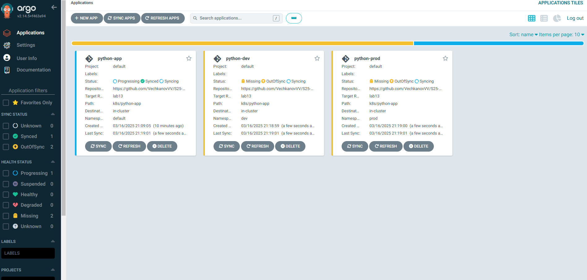
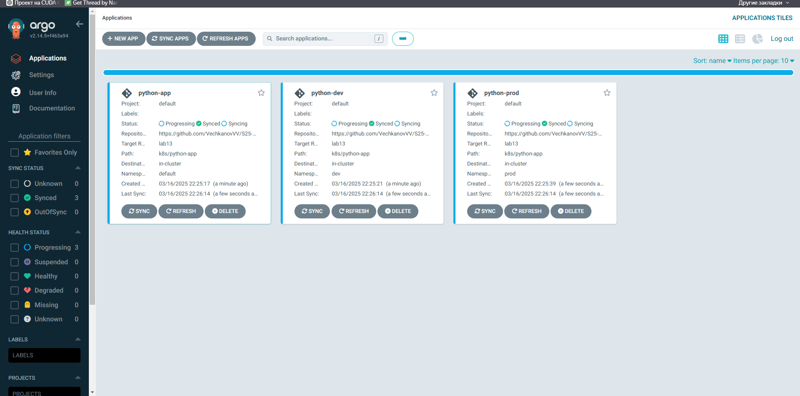

# Lab 13: ArgoCD for GitOps Deployment

## Task 1: Deploy and Configure ArgoCD

### 1. Install ArgoCD via Helm
```bash
helm repo add argo https://argoproj.github.io/argo-helm
helm install argo argo/argo-cd --namespace argocd --create-namespace
kubectl wait --for=condition=ready pod -l app.kubernetes.io/name=argocd-server -n argocd --timeout=90s

```
### 2. Install ArgoCD CLI
```bash
curl -sSL -o argocd https://github.com/argoproj/argo-cd/releases/latest/download/argocd-linux-amd64
chmod +x argocd
sudo mv argocd /usr/local/bin/
argocd version
```
### 3. Access ArgoCD UI
```bash
kubectl port-forward svc/argocd-server -n argocd 8080:443 &
kubectl -n argocd get secret argocd-initial-admin-secret -o jsonpath="{.data.password}" | base64 -d
argocd login localhost:8080 --insecure
```



### 4. Configure Application Sync
```bash
kubectl apply -f k8s/ArgoCD/argocd-python-app.yaml
```
### 5. Verify Sync
```bash
argocd app sync python-app
argocd app status python-app
```


