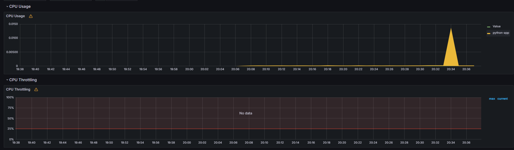
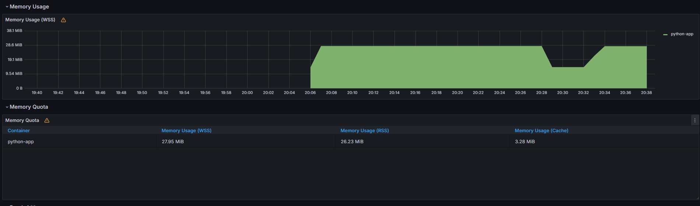
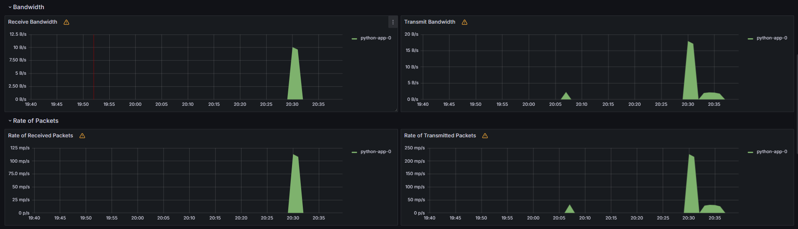

### Kube Prometheus Stack Components  

1. **Prometheus Operator** – automates Prometheus setup, creates CRDs for monitoring.  
2. **Prometheus** – collects metrics and processes queries.  
3. **Alertmanager** – manages alerts and notifications.  
4. **Grafana** – visualizes metrics through dashboards.  
5. **Node Exporter** – collects metrics from Kubernetes nodes.  
6. **Kube State Metrics** – provides metrics about the state of Kubernetes objects.  

### Cluster Resources  
#### Monitoring Namespace  
- **Pods**:  
  ```bash
  kubectl get pods -n monitoring
  ```
  
```
spider-man@main:/mnt/c/Users/vechk/OneDrive/Desktop/S25-core-course-labs$ kubectl get pods -n monitoring
NAME                                                     READY   STATUS    RESTARTS   AGE
alertmanager-monitoring-kube-prometheus-alertmanager-0   2/2     Running   0          31m
monitoring-grafana-8df5cd697-cnq6k                       3/3     Running   0          36m
monitoring-kube-prometheus-operator-56d9c87df7-7mzjb     1/1     Running   0          36m
monitoring-kube-state-metrics-5c4748cd88-k6cm9           1/1     Running   0          36m
monitoring-prometheus-node-exporter-nn5nk                1/1     Running   0          36m
prometheus-monitoring-kube-prometheus-prometheus-0       2/2     Running   0          31m
```


```bash
 kubectl get svc -n monitoring
```

```
spider-man@main:/mnt/c/Users/vechk/OneDrive/Desktop/S25-core-course-labs$ kubectl get svc -n monitoring
NAME                                      TYPE        CLUSTER-IP       EXTERNAL-IP   PORT(S)                         AGE
alertmanager-operated                     ClusterIP   None             <none>        9093/TCP,9094/TCP,9094/UDP      31m
monitoring-grafana                        NodePort    10.97.111.254    <none>        80:31511/TCP                    37m
monitoring-kube-prometheus-alertmanager   ClusterIP   10.100.205.216   <none>        9093/TCP,8080/TCP               37m
monitoring-kube-prometheus-operator       ClusterIP   10.99.162.33     <none>        443/TCP                         37m
monitoring-kube-prometheus-prometheus     NodePort    10.104.255.182   <none>        9090:30090/TCP,8080:31338/TCP   37m
monitoring-kube-state-metrics             ClusterIP   10.105.90.230    <none>        8080/TCP                        37m
monitoring-prometheus-node-exporter       ClusterIP   10.97.57.110     <none>        9100/TCP                        37m
prometheus-operated                       ClusterIP   None             <none>        9090/TCP                        31m
spider-man@main:/mnt/c/Users/vechk/OneDrive/Desktop/S25-core-course-labs$
```

```bash
 kubectl get po,sts,svc,pvc,cm -n monitoring > monitoring-resources.txt
```
see **monitoring-resources.txt**

```bash
 kubectl get po,sts,svc,pvc,cm -n default > app-resources.txt
```

see **app-resources.txt**





# Command Execution Results

## Checking the contents of the `/app/data` directory
```bash
kubectl exec python-app-0 -n default -- ls /app/data
```
```
test.html
```

## Contents of the test.html file
```bash
kubectl exec python-app-0 -n default -- cat /app/data/test.html
```

```html
<!doctype html>
<html>
<head>
    <title>Example Domain</title>
    <meta charset="utf-8" />
    <meta http-equiv="Content-type" content="text/html; charset=utf-8" />
    <meta name="viewport" content="width=device-width, initial-scale=1" />
    <style type="text/css">
    body {
        background-color: #f0f0f2;
        margin: 0;
        padding: 0;
        font-family: -apple-system, system-ui, BlinkMacSystemFont, "Segoe UI", "Open Sans", "Helvetica Neue", Helvetica, Arial, sans-serif;
    }
    div {
        width: 600px;
        margin: 5em auto;
        padding: 2em;
        background-color: #fdfdff;
        border-radius: 0.5em;
        box-shadow: 2px 3px 7px 2px rgba(0,0,0,0.02);
    }
    a:link, a:visited {
        color: #38488f;
        text-decoration: none;
    }
    @media (max-width: 700px) {
        div {
            margin: 0 auto;
            width: auto;
        }
    }
    </style>
</head>
<body>
<div>
    <h1>Example Domain</h1>
    <p>This domain is for use in illustrative examples in documents. You may use this domain in literature without prior coordination or asking for permission.</p>
    <p><a href="https://www.iana.org/domains/example">More information...</a></p>
</div>
</body>
</html>
```

