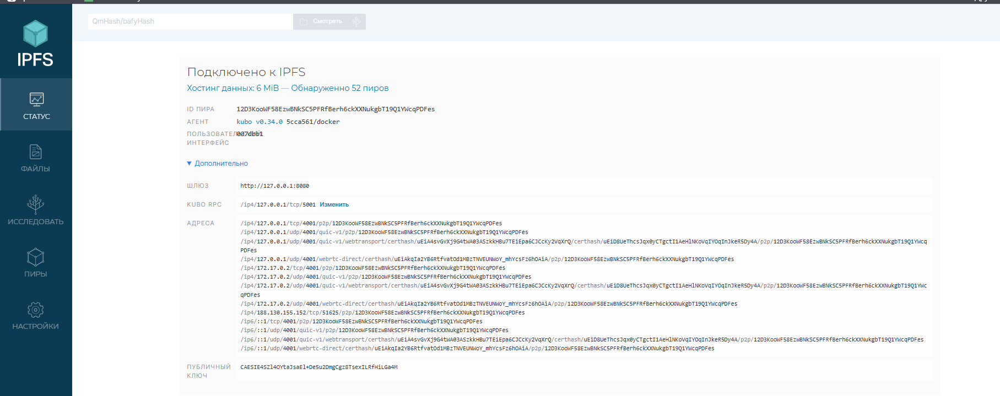
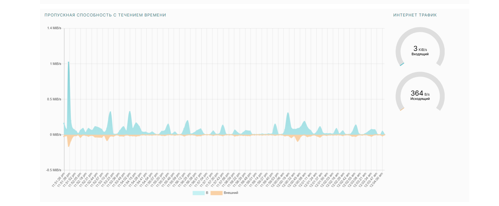

# Lab 16 Report: IPFS and Fleek

## Task 1: IPFS Gateway Setup

### File Verification
- **CID (Content Identifier):** `QmWd9cavD8UGZQcqYBVhZqs2Jure5W9cgxR7S6TC4StfZe`
- **Local Gateway Access:**  
  [http://localhost:8080/ipfs/QmWd9cavD8UGZQcqYBVhZqs2Jure5W9cgxR7S6TC4StfZe](http://localhost:8080/ipfs/QmWd9cavD8UGZQcqYBVhZqs2Jure5W9cgxR7S6TC4StfZe)
  
- **Public Gateways:**  
  - [dweb.link](https://dweb.link/ipfs/QmWd9cavD8UGZQcqYBVhZqs2Jure5W9cgxR7S6TC4StfZe) (successful)
  - [ipfs.io](https://ipfs.io/ipfs/QmWd9cavD8UGZQcqYBVhZqs2Jure5W9cgxR7S6TC4StfZe) (unreachable)

---

## Task 2: Fleek.xyz Deployment

### Project Links
- **IPFS Link:**  
  `ipfs://QmWd9cavD8UGZQcqYBVhZqs2Jure5W9cgxR7S6TC4StfZe`
- **Live Domain:**  
  [https://labs-fork.fleek.xyz](https://labs-fork.fleek.xyz)