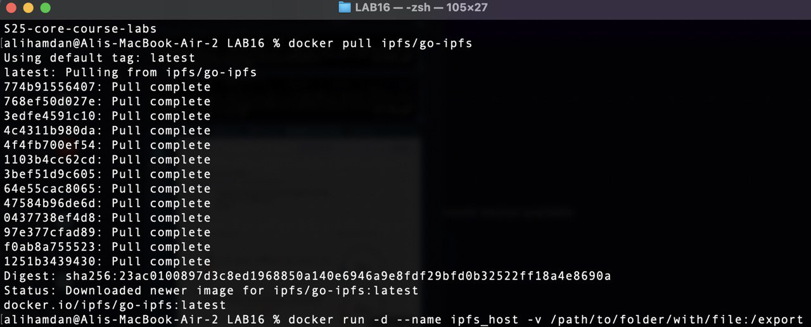
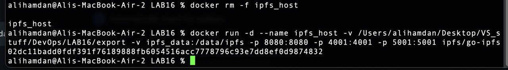
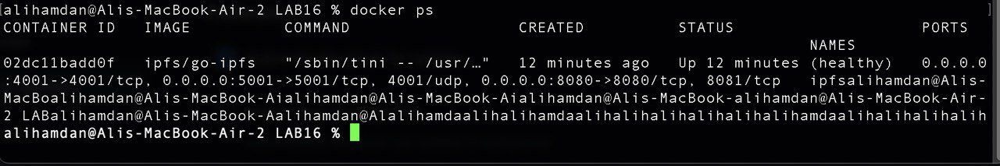
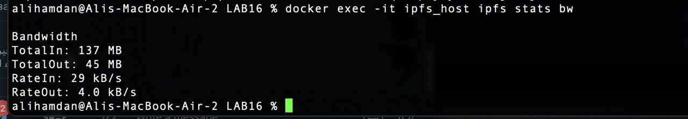
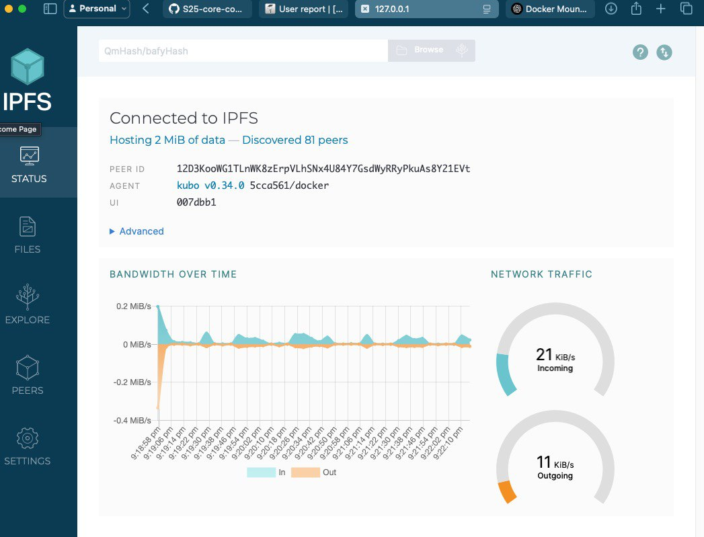
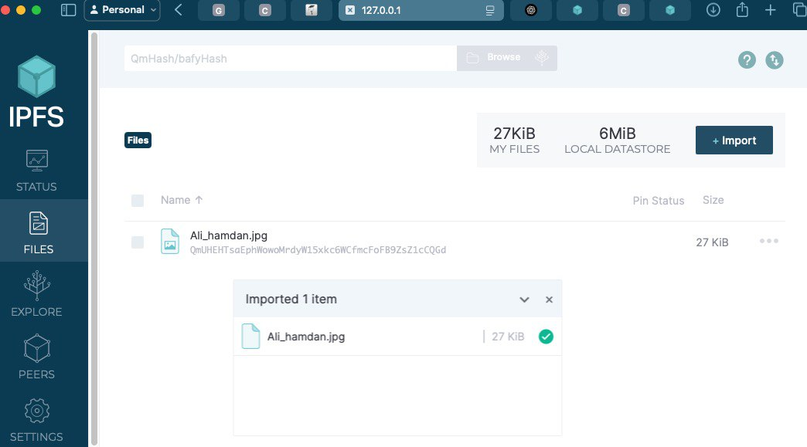

# Lab 16: IPFS and Fleek


## Task 1: Set Up an IPFS Gateway Using Docker

This task demonstrates how to set up an IPFS gateway using Docker, upload a file via the IPFS Web UI, and verify that the file is accessible using public IPFS gateways. You will also document connected peers and bandwidth statistics.

---

## Step 1: Set Up the IPFS Gateway

### 1. Pull the IPFS Docker Image

Run the following command:

```sh
docker pull ipfs/go-ipfs
```

**Output:**



---

### 2. Run the IPFS Container

Use the command below, replacing the path with your actual local export folder:

```sh
docker run -d --name ipfs_host \
  -v /Users/yourusername/Desktop/VS_stuff/DevOps/LAB16/export:/export \
  -v ipfs_data:/data/ipfs \
  -p 8080:8080 -p 4001:4001 -p 5001:5001 \
  ipfs/go-ipfs
```

**Output:**



---

### 3. Verify the Container is Running

Run the following command to check if the container is active:

```sh
docker ps
```

**Output:**



---

## Step 2: Gather Additional Information

### Connected Peers

To see the peers connected to your IPFS node, run:

```sh
docker exec -it ipfs_host ipfs swarm peers
```

**Output:**


---

### Bandwidth Statistics

To check the bandwidth usage of your IPFS node, execute:

```sh
docker exec -it ipfs_host ipfs stats bw
```

**Output:**



---

## Step 3: Results and File Upload

### Access the IPFS Web UI

- Open: [http://127.0.0.1:5001/webui/](http://127.0.0.1:5001/webui/)
- Upload a file through the UI.

### CID and Public Access

Here is my uploaded file's **CID**:

```
QmUHEHTsaEphWowoMrdyW15xkc6WCfmcFoFB9ZsZ1cCQGd
```

You can try accessing the file via the following links:

- [My File Link (IPNS)](https://ipfs.io/ipns/k51qzi5uqu5dih4m1lhxh80pmkd30mby45lg0bx7ssevds2g5ijeqpw3idedu7)
- [My File Link (DWeb)](https://bafybeicyixbqqb43ko5dtynbiu35a3tnuzkneizar4h7yad26kk4muexvy.ipfs.dweb.link?filename=Ali_hamdan.jpg)

**Screenshots:**





---

## Summary

In this task, I:
- Set up an IPFS node using Docker.
- Uploaded a file via the IPFS Web UI.
- Retrieved the CID and tested access using public gateways.
- Inspected node peers and bandwidth usage.