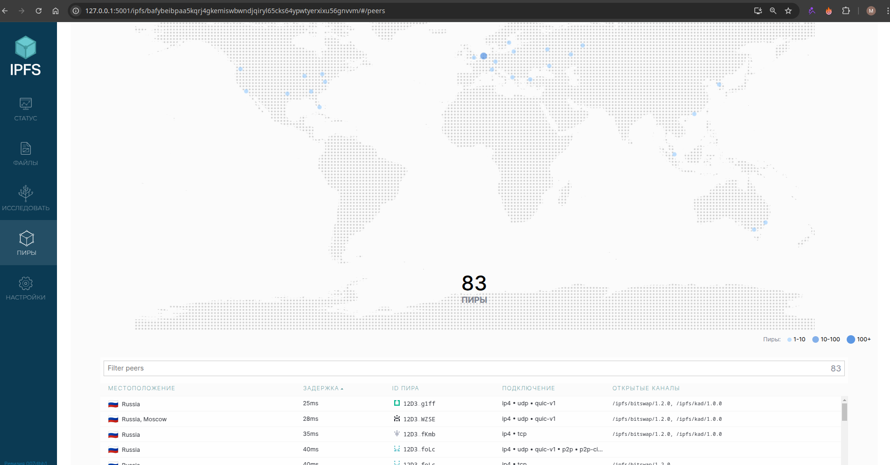

# IPFS Gateway and Fleek Deployment


## **Task 1: Set Up an IPFS Gateway Using Docker**


### **Steps Completed**

#### **1. Pull and Run the IPFS Docker Image**
The IPFS Docker image was pulled and a container was started with the following commands:

```bash
docker pull ipfs/go-ipfs
docker run -d --name ipfs_host -v /path/to/folder/with/file:/export -v ipfs_data:/data/ipfs -p 8080:8080 -p 4001:4001 -p 5001:5001 ipfs/go-ipfs
```

#### **3. Verify the IPFS Container**
The IPFS container was verified to be running using:


#### **4. Access the IPFS Web UI**
The IPFS web UI was accessed at:
```
http://127.0.0.1:5001/webui/
```


#### **5. Upload a File to IPFS**


```
CID of the file : QmbVyEts3AsotLaZQfSrRCyPUhgXa7Q6e3DoNNBwQvzCuS
```

#### **6. Verify the File on Public IPFS Gateways**
The file was verified using the following public IPFS gateways:
- **IPFS.io Gateway:**
  ```
  https://ipfs.io/ipfs/QmbVyEts3AsotLaZQfSrRCyPUhgXa7Q6e3DoNNBwQvzCuS
  ```


#### **7. Connected Peers and Bandwidth**
- **Connected Peers:** 



- **Bandwidth:**


---

## **Task 2: Set Up a Project on Fleek.xyz**

### **Steps Completed**

#### **1. Sign Up for Fleek**
- Created an account on [Fleek.xyz](https://fleek.xyz/).

#### **2. Forked the Labs Repository and Created a New Project on Fleek**
- Forked the Labs repository on GitHub.
- Connected the forked Labs repository to Fleek.
- Configured the project settings and deployed it to IPFS.


#### **5. Documentation**
- **IPFS Link:**
  ```
  https://bafybeieyc24ve6wsa2jg7gqx2k4rodzut5xgbwyxzmeinnkwat6srq6w7q.ipfs.dweb.link/
  ```


- **Fleek Domain:**
  ```
  https://abundant-shoe-fat.on-fleek.app/
  ```
