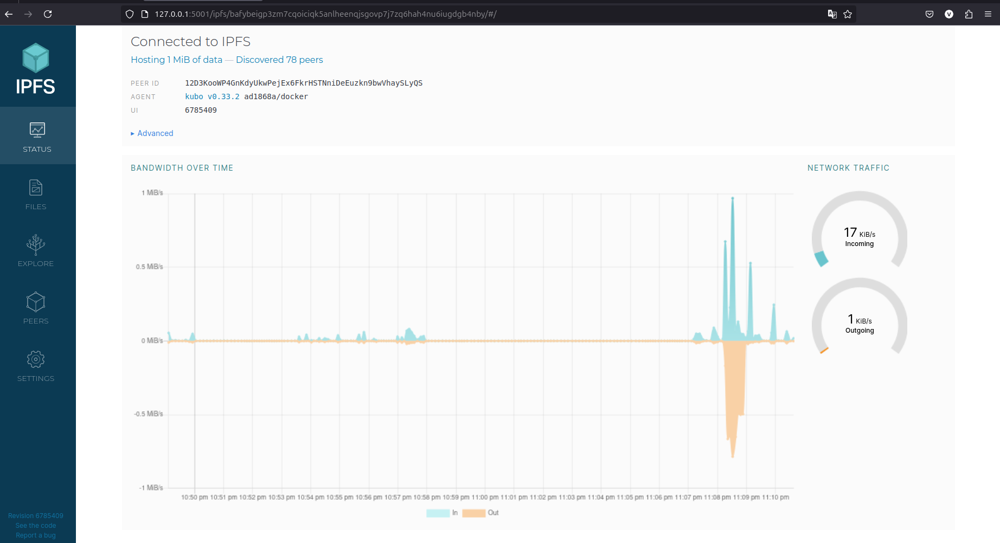
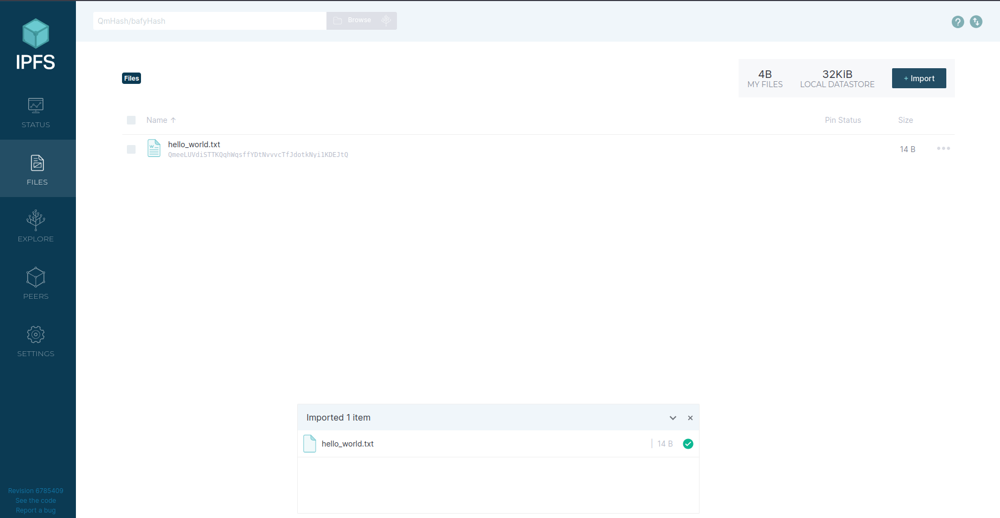
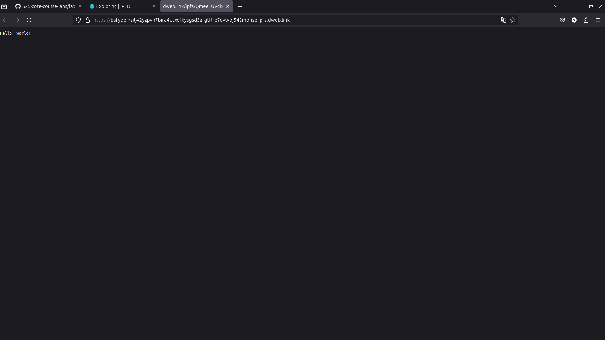
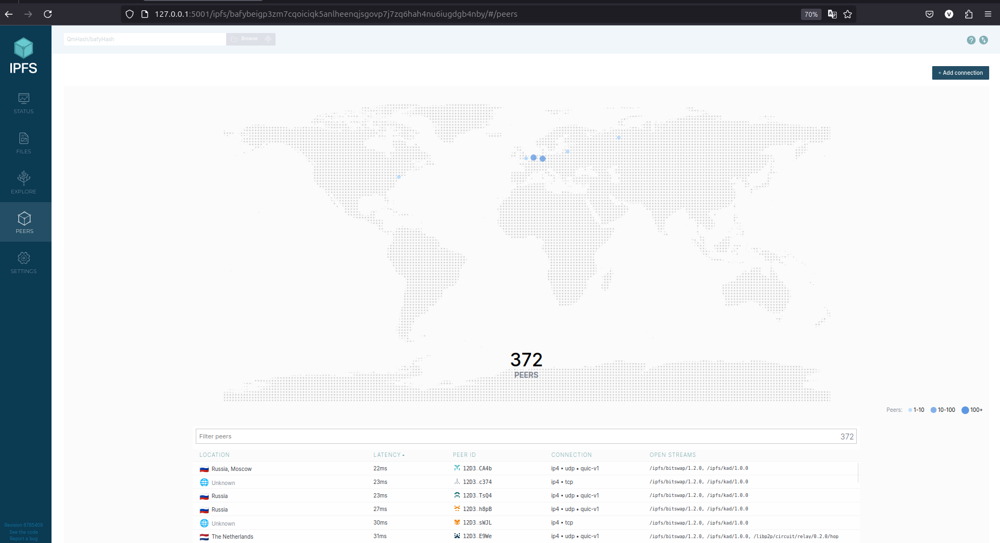
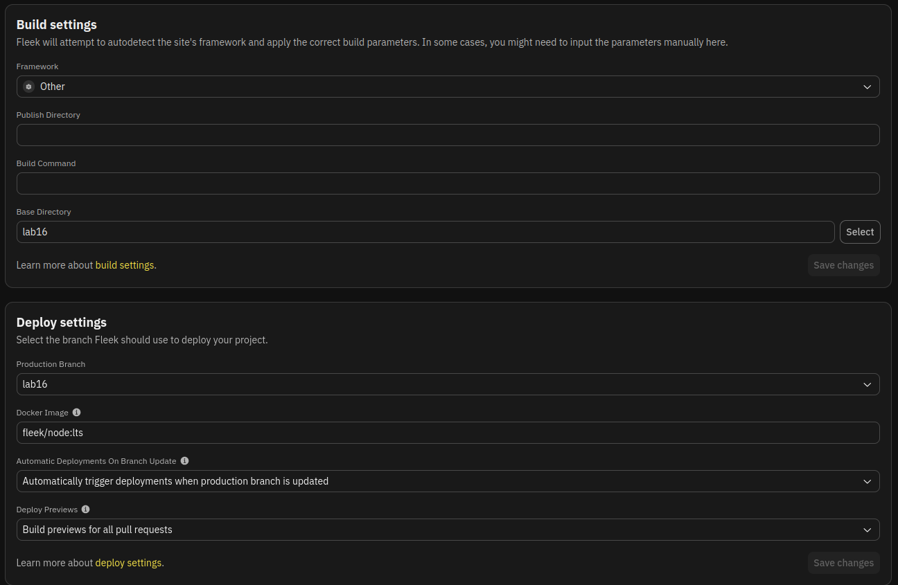
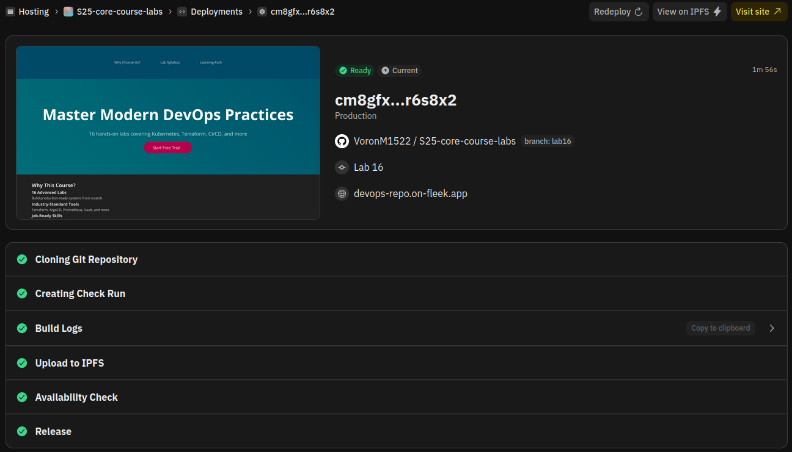
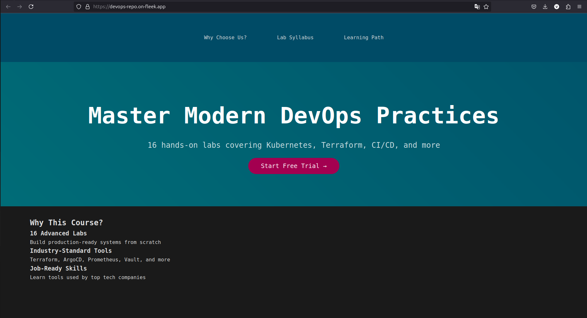
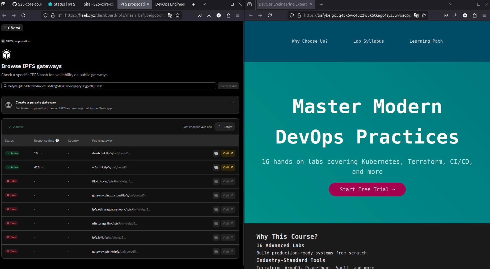

# IPFS and Fleek

## Task 1

- `docker ps`

  ```sh
  vm@vm /m/v/d/h/V/U/L/P/D/S/ipfs (lab16)> docker ps
  CONTAINER ID   IMAGE                                 COMMAND                  CREATED              STATUS                        PORTS                                                                                                                                                 NAMES
  4ed6394b7dab   ipfs/go-ipfs                          "/sbin/tini -- /usr/…"   About a minute ago   Up About a minute (healthy)   0.0.0.0:4001->4001/tcp, :::4001->4001/tcp, 0.0.0.0:5001->5001/tcp, :::5001->5001/tcp, 4001/udp, 0.0.0.0:8080->8080/tcp, :::8080->8080/tcp, 8081/tcp   ipfs_host
  34ea325dcd4a   gcr.io/k8s-minikube/kicbase:v0.0.46   "/usr/local/bin/entr…"   4 days ago           Up 3 hours                    127.0.0.1:32772->22/tcp, 127.0.0.1:32771->2376/tcp, 127.0.0.1:32770->5000/tcp, 127.0.0.1:32769->8443/tcp, 127.0.0.1:32768->32443/tcp                  minikube
  ```

  

- **Web UI**

  *There is also information about bandwidth*

  

- **Upload file**

  

- **Use public [gateway](https://dweb.link)**

  *Hash:* QmeeLUVdiSTTKQqhWqsffYDtNvvvcTfJdotkNyi1KDEJtQ

  *Link:* https://dweb.link/ipfs/QmeeLUVdiSTTKQqhWqsffYDtNvvvcTfJdotkNyi1KDEJtQ

  

- **Peers information**

  

## Task 2

- **Description**

  I deployed Labs repository from lab16 directory. Here are links:

  - *[IPFS (dweb.link/ipfs)](https://bafybeigd5q43x6wc4u22w3k5tkagc4zyz5wvoaq6pry5zijg2blkjr5n3e.ipfs.dweb.link/)* (hash: bafybeigd5q43x6wc4u22w3k5tkagc4zyz5wvoaq6pry5zijg2blkjr5n3e)
  - *[Fleek](https://devops-repo.on-fleek.app/)*

- **Workflow**

  - **Settings**

    

  - **Deployment**

    

  - **Deployed repository**

    

  - **IPFS Check**

    