# Task 1

## Create a Kubernetes Secret Using `kubectl`

- Created secret using:

```sh
kubectl create secret generic my-secret --from-literal=MY_PASS=mypassword
>>> secret/my-secret created
```

- Verify that the secret was created successfully:

```sh
kubectl get secrets
>>>
NAME        TYPE     DATA   AGE
my-secret   Opaque   1      30s
```

- Decode and verify the secret:

```sh
kubectl get secret my-secret -o jsonpath="{.data.MY_PASS}" | base64 --decode
>>> mypassword
```

```sh
kubectl describe secret my-secret
>>>
Name:         my-secret
Namespace:    default
Labels:       <none>
Annotations:  <none>

Type:  Opaque

Data
====
MY_PASS:  10 bytes
```

```sh
kubectl get secret my-secret -o yaml
apiVersion: v1
data:
  MY_PASS: bXlwYXNzd29yZA==
kind: Secret
metadata:
  creationTimestamp: "2025-03-08T16:16:13Z"
  name: my-secret
  namespace: default
  resourceVersion: "411"
  uid: 763b43e4-e023-4ef0-8f3b-f5270197cb59
type: Opaque
```

## Manage Secrets with Helm

Install a GPG and GUI by typing `sudo apt-get install gnupg` and `sudo apt-get install kgpg`.

Then, I followed the provided video tutorial to set my Helm Secrets and update Helm deployment.

### **Generate key pair**

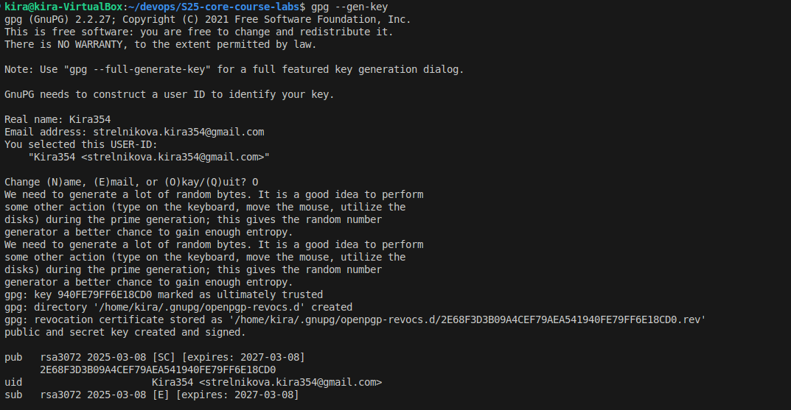

### **Verify that the pair successfully created**

```sh
gpg --list-keys
gpg: checking the trustdb
gpg: marginals needed: 3  completes needed: 1  trust model: pgp
gpg: depth: 0  valid:   1  signed:   0  trust: 0-, 0q, 0n, 0m, 0f, 1u
gpg: next trustdb check due at 2027-03-08
/home/kira/.gnupg/pubring.kbx
-----------------------------
pub   rsa3072 2025-03-08 [SC] [expires: 2027-03-08]
      2E68F3D3B09A4CEF79AEA541940FE79FF6E18CD0
uid           [ultimate] Kira354 <strelnikova.kira354@gmail.com>
sub   rsa3072 2025-03-08 [E] [expires: 2027-03-08]
```

Then run:

```sh
sops -p 2E68F3D3B09A4CEF79AEA541940FE79FF6E18CD0 secrets.yaml
```

### **Set the secret password in opened text editor**

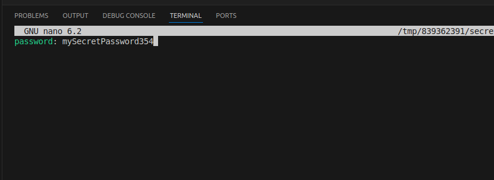

### **Verify the secrets**

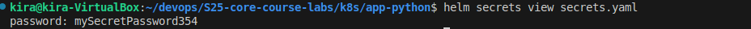

### **Add an env field to Deployment. The path to update is: `spectemplate.spec.containers.env`**

```sh
env:
  - name: MY_PASSWORD
    valueFrom:
      secretKeyRef:
        name: credentials
        key: password
```

### **Update Helm chart**

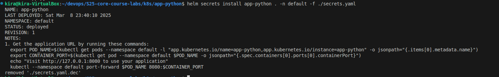

### **Verify that the password was set correctly**

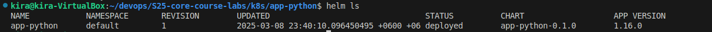

```sh
kubectl get secret credentials -o yaml
apiVersion: v1
data:
  password: bXlTZWNyZXRQYXNzd29yZDM1NA==
kind: Secret
metadata:
  annotations:
    meta.helm.sh/release-name: app-python
    meta.helm.sh/release-namespace: default
  creationTimestamp: "2025-03-08T17:40:34Z"
  labels:
    app: app-python
    app.kubernetes.io/managed-by: Helm
    chart: app-python-0.1.0
    heritage: Helm
    release: app-python
  name: credentials
  namespace: default
  resourceVersion: "4535"
  uid: 42bd4980-d289-4f32-9157-c89c3bc66b8a
type: Opaque
```

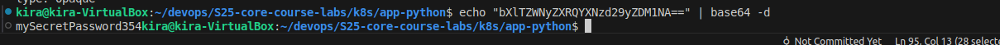

### **View the pods**

```sh
kubectl get po
NAME                         READY   STATUS    RESTARTS   AGE
app-python-c4786985c-5qfg2   1/1     Running   0          19m
```

### **Verify secret inside the pod**

In previous labs I used distroless image of my app, so now I need to run command `kubectl exec app-python-c4786985c-5qfg2 -- python -c "import os; print('\n'.join(f'{k}={v}' for k, v in os.environ.items()))"`:

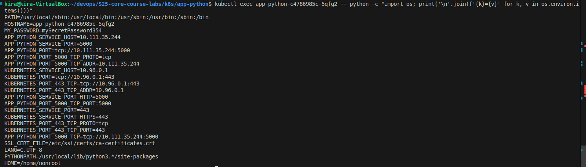


# Task 2

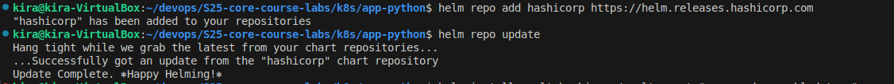
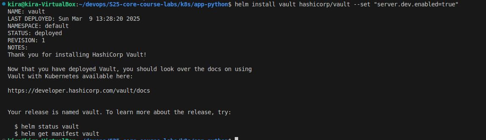
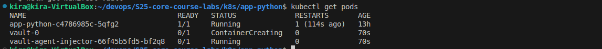


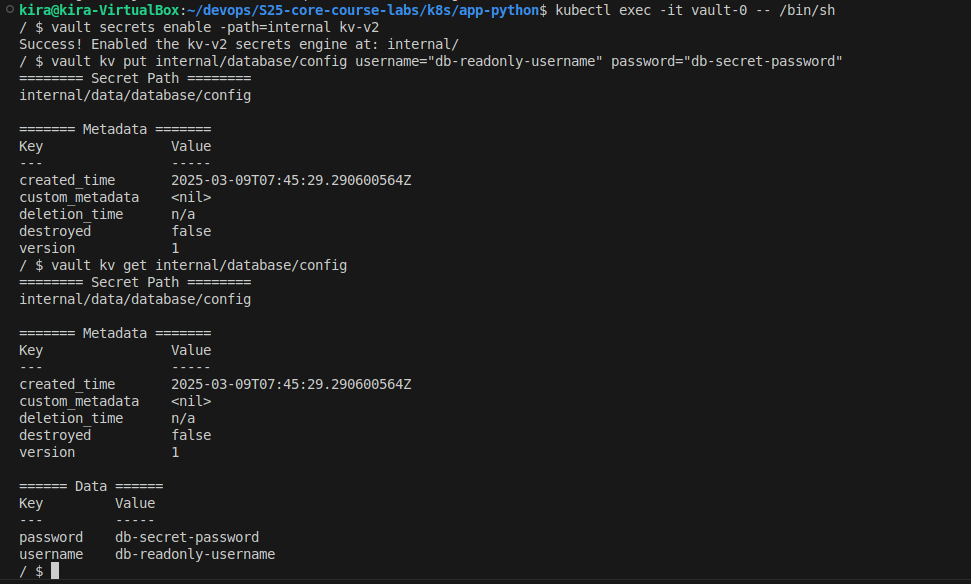
