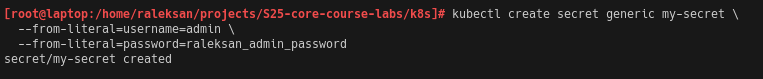
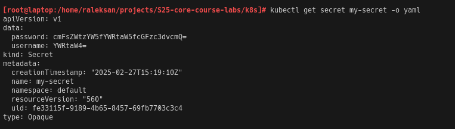
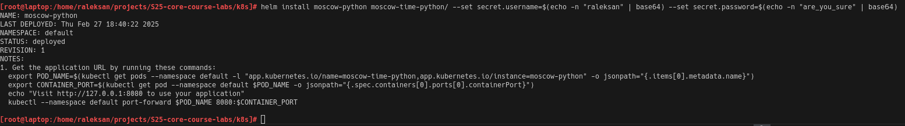
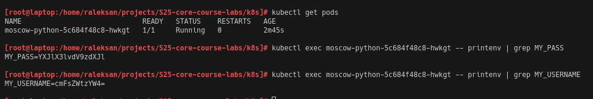

# Lab 11

## Task 1: Kubernetes Secrets and Resource Management

### 1. Create a Secret Using kubectl:

Firstly I start `minikube` with 

```bash
[root@laptop:/home/raleksan/projects/S25-core-course-labs/k8s]# minikube start --force
😄  minikube v1.34.0 on Nixos 24.11
    ▪ MINIKUBE_WANTUPDATENOTIFICATION=false
❗  minikube skips various validations when --force is supplied; this may lead to unexpected behavior
✨  Using the docker driver based on existing profile
🛑  The "docker" driver should not be used with root privileges. If you wish to continue as root, use --force.
💡  If you are running minikube within a VM, consider using --driver=none:
📘    https://minikube.sigs.k8s.io/docs/reference/drivers/none/
💡  Tip: To remove this root owned cluster, run: sudo minikube delete
👍  Starting "minikube" primary control-plane node in "minikube" cluster
🚜  Pulling base image v0.0.45 ...
🏃  Updating the running docker "minikube" container ...
🐳  Preparing Kubernetes v1.31.0 on Docker 27.2.0 ...
    ▪ Generating certificates and keys ...
    ▪ Booting up control plane ...
    ▪ Configuring RBAC rules ...
🔗  Configuring bridge CNI (Container Networking Interface) ...
🔎  Verifying Kubernetes components...
    ▪ Using image gcr.io/k8s-minikube/storage-provisioner:v5
🌟  Enabled addons: storage-provisioner, default-storageclass
🏄  Done! kubectl is now configured to use "minikube" cluster and "default" namespace by default
```

Create secret with:

```bash
kubectl create secret generic my-secret \
  --from-literal=username=admin \
  --from-literal=password=raleksan_admin_password
```



### 2. Verify and Decode Your Secret:

- Get secret

```bash
kubectl get secret my-secret -o yaml
```



- Decode secret

```bash
echo "<base64-encoded-password>" | base64 --decode
# or 
echo "cmFsZWtzYW5fYWRtaW5fcGFzc3dvcmQ=" | base64 --decode
```


### 3. Manage Secrets with Helm:

To manage secrets with `Helm` I created following `templates/secrets.yaml`

```yaml
apiVersion: v1
kind: Secret
metadata:
  name: my-helm-secret
type: Opaque
data:
  username: {{ .Values.secret.username | b64enc }}
  password: {{ .Values.secret.password | b64enc }}
```

and extend `templates/deployment.yaml`

```yaml
# Beginning part of config
env:
- name: MY_USERNAME
    valueFrom:
    secretKeyRef:
        name: my-helm-secret
        key: username
- name: MY_PASS
    valueFrom:
    secretKeyRef:
        name: my-helm-secret
        key: password
```

Now I can deploy `Helm` Chart:

```bash
helm install moscow-python moscow-time-python/ --set secret.username=$(echo -n "raleksan" | base64) --set secret.password=$(echo -n "are_you_sure" | base64)
```



Extract `PASS` from deployment:

- Find pod name:

```bash
kubectl get pods
```

- Extract value

```bash
kubectl exec <pod-name> -- printenv | grep MY_PASS
# or
kubectl exec moscow-python-5c684f48c8-hwkgt -- printenv | grep MY_PASS
```




## Task 2: Vault Secret Management System


## Bonus Task: Resource Management and Environment Variables


